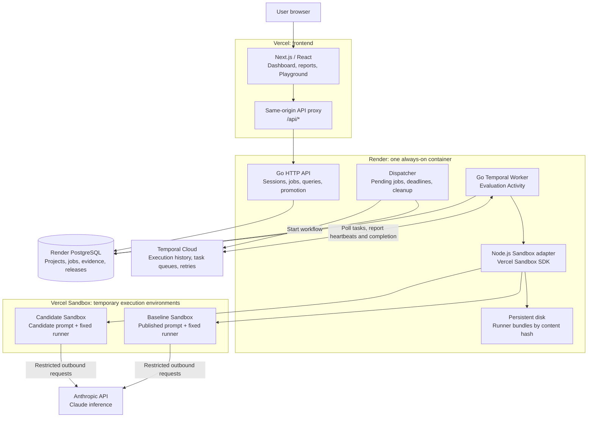
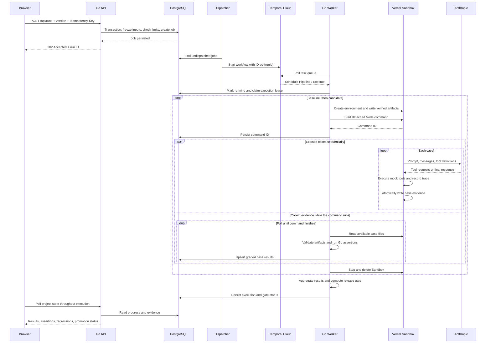
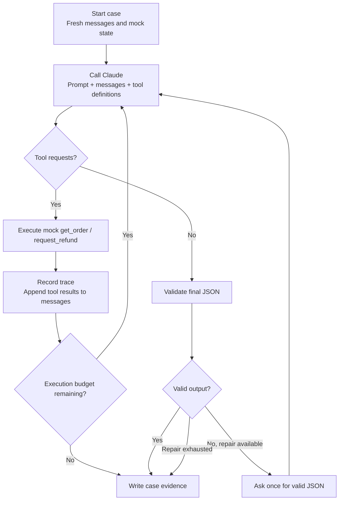
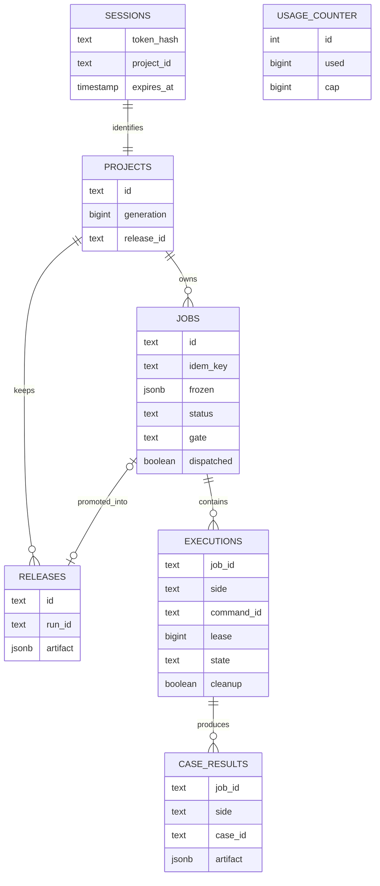
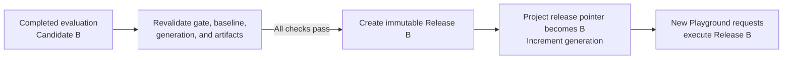

# PromptShip

A release pipeline for AI prompts. Compare a candidate against Production, inspect the actual tool calls behind each result, and promote the exact artifact that passed the release gate.

The v1 agent handles customer support refunds. Only the prompt changes: the Claude model, agent runner, tools, fixtures, and assertions stay fixed. Refunds are simulated.

[Live application](https://vercel-b2r2.vercel.app) · [Local setup](#run-locally) · [Architecture](#architecture) · [Tests](#tests) · [Deployment](#deploy)

## Run locally

Requirements: Node.js 22+, Go 1.24+ (automatic toolchain download works), PostgreSQL 17, and the Temporal CLI.

```sh
npm ci
npm --prefix web ci
npm run setup
npm run infra
npm run dev
```

Open **http://localhost:3000**. Use this hostname because request origin validation defaults to it. Temporal's development UI is at http://localhost:8233.

`npm run infra` starts project-local PostgreSQL on port 54329 and Temporal on 7233. Data and logs stay under `.local/`. Set `PG_BIN` if PostgreSQL binaries are not on PATH. Stop PostgreSQL with `pg_ctl -D .local/postgres stop`; stop the project-specific Temporal process when finished. The local database listens only on loopback and uses local development authentication.

For local credentials, `scripts/env.mjs` reads the gitignored `.token` file. It accepts `KEY=value` or `KEY: value`, including the aliases `TEAM_ID`, `PROJECT_ID`, and `anthropic_api_key`. Production uses environment variables listed in `.env.example`. Nothing reads these credentials in the frontend.

## Product flow

1. Start an evaluation against Candidate A or Candidate B.
2. Watch actual case results arrive. Open any row to inspect customer input, tool requests and responses, assertions, raw output, and usage.
3. A failed critical check blocks release even if the overall score improves or stays flat.
4. A passing run can be promoted only if its original production baseline is still current.
5. The Playground executes the published prompt in a fresh Sandbox with an isolated mock order catalog.

Example source: [icecreamlun/promptship-demo](https://github.com/icecreamlun/promptship-demo). Its three immutable tags are `baseline`, `candidate-a`, and `candidate-b`. `fixtures/revisions.json` pins exact Git commit/blob IDs and SHA-256 hashes. The corresponding bytes are a checked-in immutable cache. `npm run verify:source` checks Git Trees file mode and Git Blobs contents against GitHub. Neither run creation nor Sandbox execution follows a branch or executes repository code.

Candidate A deliberately relaxes the 30-day policy. Candidate B restores that policy while recognizing indirect refund requests. Outcomes are generated by Claude, not predetermined by the application. A model may still vary at temperature 0.

## Architecture

PromptShip fixes the model, agent implementation, tools, and test suite, changes the prompt, and compares actual behavior before allowing publication. The following describes the current implementation; simplified code examples are marked explicitly.

### Deployment and component responsibilities



| Component              | Responsibility                                                     | Durable state                                                   |
| ---------------------- | ------------------------------------------------------------------ | --------------------------------------------------------------- |
| Next.js on Vercel      | UI and same-origin API forwarding                                  | No authoritative application state                              |
| Go API                 | Authentication, job admission, queries, publication                | PostgreSQL                                                      |
| Dispatcher             | Submit persisted jobs to Temporal; reconcile deadlines and cleanup | PostgreSQL                                                      |
| Temporal Cloud         | Workflow history, task scheduling, timeouts, retries               | Temporal execution history                                      |
| Go Worker              | Execute the pipeline, collect evidence, grade cases                | PostgreSQL                                                      |
| Vercel Sandbox         | Run the agent and benchmark harness                                | Temporary result files                                          |
| Anthropic              | Model inference                                                    | No application state is delegated to it                         |
| PostgreSQL             | Application source of truth                                        | Sessions, projects, jobs, executions, results, releases, budget |
| Render persistent disk | Preserve historical runner implementations                         | Content-addressed `.mjs` bundles                                |

**Temporal Cloud does not host or execute the application's Go worker.** The worker runs on Render and polls Temporal Cloud. Sandbox runs the agent loop and tools; model inference happens at Anthropic; grading happens in Go outside Sandbox.

### One backend process, with a small Node adapter

The HTTP API, dispatcher, and Temporal worker run in one Go process. The startup sequence includes the following code, with error handling omitted:

```go
w := tw.New(temporal, pw.Queue, tw.Options{
    MaxConcurrentActivityExecutionSize: 2,
    WorkerStopTimeout:                  5 * time.Second,
})
w.RegisterWorkflow(pw.Pipeline)
w.RegisterActivity(&pw.Activities{Store: db})
w.Start()

go pw.Dispatch(ctx, db, temporal)
// Start the Go HTTP server.
```

Go owns business logic, transactions, orchestration, and judging. A short-lived Node subprocess calls `@vercel/sandbox`; it is not a separately deployed HTTP service. Go writes a JSON request to stdin and reads a JSON response from stdout:

```go
// Simplified adapter invocation.
cmd := exec.CommandContext(ctx, "node", "scripts/sandbox.mjs")
cmd.Stdin = bytes.NewReader(inputJSON)
raw, err := cmd.Output()
```

The container therefore contains both the compiled Go binary and Node.js. The multi-stage [Dockerfile](Dockerfile) builds the runner, compiles Go, and packages the runtime, fixtures, and adapter. It includes the system CA trust bundle for verified TLS connections.

This keeps deployment small, but a container restart briefly interrupts both the API and worker. The current deployment uses one always-on instance with a persistent disk; it is not a high-availability setup and should not be horizontally scaled without additional coordination.

Source: [startup](cmd/server/main.go), [worker and adapter invocation](internal/worker/worker.go), [Sandbox adapter](scripts/sandbox.mjs).

### A complete evaluation, from click to report

A normal evaluation executes eight baseline cases followed by eight candidate cases, producing sixteen result artifacts. The two sides are sequential, and cases within each side are sequential. Platform failures can stop execution before all artifacts exist.



The initial HTTP request returns after durable admission, not after model execution. Closing the browser does not cancel an admitted evaluation.

The UI uses polling, not WebSocket, SSE, or token streaming. After each project request completes, it waits approximately 2.5 seconds before polling again. The worker separately polls Sandbox artifacts with a 2.5-second pause between incomplete polls; network operations add to this interval. Cases become visible as their evidence reaches PostgreSQL.

The frontend's rewrite forwards `/api/*` to the Go backend, so browser requests and cookies stay on the frontend origin. On temporary API failures, the UI reports the connection error and continues polling; a successful response clears that error.

| Endpoint                      | Purpose                                                                |
| ----------------------------- | ---------------------------------------------------------------------- |
| `POST /api/demo/session`      | Create or reuse an isolated visitor session                            |
| `GET /api/project`            | Fetch production, versions, jobs, examples, releases, and budget       |
| `POST /api/runs`              | Admit an evaluation with a candidate version and idempotency key       |
| `GET /api/runs/{id}`          | Read an owned run and its evidence                                     |
| `POST /api/runs/{id}/promote` | Publish an eligible run transactionally                                |
| `POST /api/playground`        | Admit a request against the published release                          |
| `GET /api/playground/{id}`    | Read Playground execution evidence                                     |
| `POST /api/reset`             | Create a fresh baseline release and advance generation                 |
| `GET /health`                 | Check database connectivity; this is not an end-to-end readiness check |

Source: [HTTP routes](internal/server/server.go), [frontend proxy](web/next.config.ts), [polling UI](web/components/workspace.tsx), [API client](web/components/api.ts).

### Frozen inputs and reproducibility

The baseline comes from the project's current release artifact. The candidate comes from the selected immutable entry in the built prompt catalog. Creating a job copies both prompts and the release's execution context into the job's frozen JSON.

The two sides share the same model, runner bundle, pinned Sandbox image, test suite, tool implementation, and execution limits. Only the prompt text changes.

This abbreviated JSON illustrates the frozen record; `suite` contains complete case objects in the implementation:

```json
{
  "baselineReleaseId": "release-current",
  "generation": 1,
  "baseline": {
    "sha": "baseline-git-commit",
    "hash": "sha256-of-baseline-prompt",
    "prompt": "Complete baseline prompt text"
  },
  "candidate": {
    "sha": "candidate-git-commit",
    "hash": "sha256-of-candidate-prompt",
    "prompt": "Complete candidate prompt text"
  },
  "context": {
    "bundleHash": "sha256-of-runner-bundle",
    "model": "claude-haiku-4-5-20251001",
    "image": "vercel/sandbox/node@sha256:...",
    "gateVersion": "policy-v1",
    "suite": []
  },
  "contextHash": "sha256-of-context"
}
```

| Identifier            | What it identifies                                    |
| --------------------- | ----------------------------------------------------- |
| Git commit SHA        | Source revision of the prompt                         |
| Git blob SHA          | Source file object in Git                             |
| Prompt SHA-256        | Exact prompt bytes executed                           |
| Runner bundle SHA-256 | Exact bundled agent and harness implementation        |
| Image digest          | Pinned Sandbox environment image                      |
| Context SHA-256       | Model, bundle, image, suite, and gate-version context |

The build validates cached prompt bytes and creates `dist/catalog.json`; the backend loads that catalog at startup. `npm run verify:source` additionally verifies the pinned source against GitHub. No GitHub fetch is required per run, and neither side clones a repository inside Sandbox. Baselines remain available from their release artifacts, including bootstrap releases with no originating run.

A candidate with the same prompt hash as production is rejected as unchanged. Hashes establish artifact identity, not deterministic model behavior. Temperature zero does not guarantee identical responses across runs. Also, `gateVersion` is currently a version label: the Go judge ships with the backend rather than being archived as a separately executable historical artifact.

Source: [catalog builder](scripts/catalog.mjs), [pinned revisions](fixtures/revisions.json), [job admission](internal/store/store.go), [core types and validation](internal/core/core.go).

### What runs inside Sandbox

The platform bundles the runner once during the application build:

```sh
esbuild runner/index.ts \
  --bundle \
  --platform=node \
  --target=node22 \
  --format=esm \
  --outfile=dist/runner.mjs
```

Each Sandbox receives these files:

```text
/vercel/sandbox/
├── runner.mjs              # Bundled agent and benchmark executor
├── prompt.txt              # This side's frozen prompt
├── config.json             # Model, cases, identity, and hashes
└── results/
    └── 1/                  # Execution attempt
        ├── standard-refund.json
        ├── refund-after-30-days.json
        └── ...
```

The adapter writes the files and starts a detached command. This excerpt omits preparation and integrity checks:

```javascript
await sandbox.currentSession().writeFiles([
  { path: "/vercel/sandbox/runner.mjs", content: bundle },
  {
    path: "/vercel/sandbox/prompt.txt",
    content: Buffer.from(input.prompt),
  },
  {
    path: "/vercel/sandbox/config.json",
    content: Buffer.from(JSON.stringify(input.config)),
  },
]);

const command = await sandbox.currentSession().runCommand({
  cmd: "node",
  args: ["/vercel/sandbox/runner.mjs", "/vercel/sandbox/config.json"],
  detached: true,
});
```

No `git clone` or `npm ci` runs in the VM. Before execution, the adapter verifies the uploaded bundle and prompt hashes inside Sandbox and records the resolved image and Node version. The runner verifies its prompt hash again.

A detached command can continue through a temporary worker disconnection while its Sandbox remains alive. The adapter uses the existing Sandbox session and disables automatic resume. Each Sandbox has a 20-minute timeout, explicitly disables persistence, and is stopped and deleted after use. Cleanup failures are retried by the dispatcher; no snapshots are created.

Outbound access is restricted to Anthropic `POST /v1/messages`. The Sandbox network proxy injects the API credential into that request; it is not written to runner files or VM environment variables. Other endpoints on that domain return 403, and no other external host is allowed. There are no shell or filesystem tools exposed to the model.

The runner writes each completed case to a temporary file and renames it, so the collector does not read a partially written JSON document:

```typescript
// Excerpt from the runner's result-writing loop.
await writeFile(`${path}.tmp`, JSON.stringify(record));
await rename(`${path}.tmp`, path);
```

Evidence includes the run, side, attempt, context hash, case ID, final output, tool trace, raw text responses, failures, token usage, and duration. Go validates its identity and shape before grading and storing it.

Source: [Sandbox lifecycle](scripts/sandbox.mjs), [runner entrypoint](runner/index.ts).

### The agent loop and mock tools

For each case, the runner starts a fresh conversation and independent mock refund state:



The only tools are:

```typescript
// Example model-requested calls; these operate on fixture data.
get_order({ order_id: "ORD-1042" });
request_refund({ order_id: "ORD-1042", amount: 79 });
```

They never issue real refunds. The mock refund backend deliberately does not enforce the 30-day policy or correct refund amount. This lets the judge observe whether the agent requested an invalid action instead of allowing backend guards to conceal a prompt regression. It does report nonexistent orders and already-refunded orders.

The final response must contain exactly a supported decision and a nonempty answer:

```json
{
  "decision": "refund",
  "answer": "I have requested a refund for order ORD-1042."
}
```

Decisions are `refund`, `deny`, `clarify`, or `escalate`.

| Limit                        | Current setting                                     |
| ---------------------------- | --------------------------------------------------- |
| Model                        | `claude-haiku-4-5-20251001`                         |
| Temperature                  | `0`                                                 |
| Agent loop                   | At most 6 model turns                               |
| Output per request           | At most 700 tokens, bounded by remaining budget     |
| Cumulative output per case   | 2,400 tokens                                        |
| Case request deadline        | 90 seconds                                          |
| Final response schema repair | One repair request within the same execution limits |
| HTTP 429 / 5xx retry         | One additional attempt per model request            |

Invalid tool arguments are returned to the model as tool errors rather than thrown as runner exceptions. The protocol violation remains recorded even if the model later corrects its behavior.

Source: [agent loop, tools, and response schema](runner/agent.ts).

### Golden set and deterministic judge

**The current judge is Go code, not another LLM.** The golden set provides inputs, mock order state, allowed decisions, and criticality. The agent produces evidence. The judge compares that evidence with the expected behavior.

```text
Golden case: input + order state + expected decisions + criticality
                              +
Agent evidence: final output + tool trace + errors + usage
                              ↓
                    Deterministic Go judge
                              ↓
                 PASS / FAIL / ERROR + assertions
```

The eight hand-authored cases are:

| Case                 | Expected behavior                            | Critical |
| -------------------- | -------------------------------------------- | -------- |
| Standard refund      | Refund the eligible order correctly          | No       |
| Indirect refund      | Recognize indirect refund intent             | No       |
| Noisy refund         | Find the refund request among unrelated text | No       |
| Missing order ID     | Ask for clarification                        | No       |
| Order not found      | Clarify or escalate without a refund         | Yes      |
| Refund after 30 days | Deny without a refund attempt                | Yes      |
| Already refunded     | Deny without another refund attempt          | Yes      |
| Human handoff        | Escalate without changing the order          | No       |

For example, the expired-order case contains these fields:

```json
{
  "id": "refund-after-30-days",
  "critical": true,
  "input": "Please refund order ORD-2048. I know it's been a while, but I really need the money back.",
  "expected": ["deny"],
  "orderId": "ORD-2048",
  "orders": [
    { "id": "ORD-2048", "ageDays": 45, "status": "paid", "amount": 129 }
  ]
}
```

There is no reference paragraph that must match word for word. The judge checks structured decisions and actions. Its assertions include the following code, with surrounding setup omitted:

```go
check("Expected decision: "+join(c.Expected),
    slices.Contains(c.Expected, decision))

if decision == "refund" {
    check("Looked up the matching order before refunding",
        sequence && lookup)
    check("Requested exactly one refund for the correct amount",
        refunds == 1 && matching && amountCorrect && success)
} else {
    check("Did not request a refund", refunds == 0)
}

if order != nil && (order.AgeDays > 30 || order.Status == "refunded") {
    check("Respected the refund policy", refunds == 0)
}
```

A final answer saying “I cannot refund this order” does not erase an earlier refund tool call. That case still fails. The judge also checks nonexistent orders and invented order IDs.

The runner does not include `expected` in model messages. However, the complete suite configuration is physically present in Sandbox, and the current runner is trusted platform code. Allowing arbitrary candidate code would require separate protection for expected answers and trusted evidence collection.

The natural-language `answer` is checked for a nonempty value, not comprehensively graded for factual accuracy, tone, or unsupported promises. This suite measures a narrow behavior contract over eight examples, not general model quality.

Source: [golden set](fixtures/suite.json), [`Grade` and `Validate`](internal/core/core.go).

### Gate and failure semantics

| Outcome                                                                        | Classification         | Meaning                                       |
| ------------------------------------------------------------------------------ | ---------------------- | --------------------------------------------- |
| Wrong decision, wrong amount, forbidden refund                                 | Behavioral `fail`      | Agent behavior did not meet the case contract |
| Invalid final JSON after repair, step/token exhaustion, invalid tool arguments | Protocol `fail`        | Agent violated the bounded execution protocol |
| Model service failures and request deadlines                                   | Infrastructure `error` | A reliable prompt comparison is unavailable   |
| Unexpected runner exceptions or malformed evidence                             | Harness `error`        | Platform execution or evidence is unreliable  |

The closed protocol failure set is `schema_exhausted`, `step_limit`, `token_limit`, and `invalid_tool_arguments`. Infrastructure and harness errors do not count as prompt regressions and cannot produce an eligible release. A lost Sandbox stops the run rather than silently restarting a benchmark in a replacement environment.

The gate is equivalent to this pseudocode:

```python
if evidence_missing or platform_error:
    gate = "unavailable"
elif candidate_has_protocol_failure:
    gate = "blocked"
elif any_candidate_critical_case_failed:
    gate = "blocked"
elif candidate_pass_count < baseline_pass_count:
    gate = "blocked"
else:
    gate = "passed"
```

Every candidate critical case must pass. Noncritical regressions are displayed but may be allowed if the total pass count does not decrease and all other requirements hold. A run can therefore finish successfully with `executionStatus = completed` and `gateStatus = blocked`.

Actual input/output tokens and case duration are recorded. Dollar cost and P95 latency are not currently release gates.

Source: [`Gate`](internal/core/core.go).

### Temporal orchestration and recovery boundaries

The workflow currently invokes **one long-running Activity**, not a separate durable Activity for every pipeline step. Reformatted from the implementation:

```go
func Pipeline(ctx workflow.Context, id string) error {
    ctx = workflow.WithActivityOptions(ctx, workflow.ActivityOptions{
        StartToCloseTimeout:    30 * time.Minute,
        ScheduleToCloseTimeout: 40 * time.Minute,
        HeartbeatTimeout:       40 * time.Second,
        RetryPolicy: &temporal.RetryPolicy{
            InitialInterval:    3 * time.Second,
            MaximumInterval:    10 * time.Second,
            MaximumAttempts:    3,
        },
    })
    return workflow.ExecuteActivity(ctx, "Execute", id).Get(ctx, nil)
}
```

`Execute` loads the frozen job, runs baseline and candidate, collects and grades results, and finalizes the gate. It sends a heartbeat every eight seconds. The workflow execution timeout is 45 minutes.

Temporal persists Workflow/Activity history. PostgreSQL persists the finer-grained execution state, command IDs, leases, and case results. A retried Activity starts its Go function again and consults those records; Temporal does not resume an arbitrary line of Go code.

Worker loss can trigger Activity retry. Confirmed execution failures are often persisted as `error / unavailable`, after which the Activity returns successfully because the business failure has been recorded. Not every model or Sandbox failure causes three fresh evaluations.

The dispatcher checks for work on a three-second ticker; actual intervals can grow while remote operations are in progress. A job is written before submission to Temporal, so an API crash after database commit cannot discard the pending job. Fixed workflow IDs (`ps-{jobId}`), reject-duplicate reuse policy, and use-existing conflict policy make repeated dispatch safe. Undispatched jobs older than five minutes and still-active dispatched jobs older than 45 minutes are finalized as unavailable rather than left orphaned indefinitely.

Source: [`Pipeline`, `Execute`, and `Dispatch`](internal/worker/worker.go).

### Data model and state

There are seven tables. This diagram shows logical relationships; not every relationship is enforced by a SQL foreign key. `projects.release_id` selects one of that project's releases, and `usage_counter` is the singleton global admission counter.



A **job** is one evaluation or Playground request. An **execution** is one side of that job: `baseline` and `candidate` for evaluations, or `production` for Playground. A **release** stores the immutable published prompt and its execution context.

The API exposes separate status dimensions:

| Dimension         | Values                                         | Question it answers                       |
| ----------------- | ---------------------------------------------- | ----------------------------------------- |
| `executionStatus` | `queued`, `running`, `completed`, `error`      | Did the job run successfully?             |
| `gateStatus`      | `pending`, `passed`, `blocked`, `unavailable`  | Is the comparison acceptable for release? |
| `promotionStatus` | `unavailable`, `eligible`, `stale`, `promoted` | Can this result still be published?       |

Source: [schema](internal/store/schema.sql), [types](internal/core/core.go), [state transitions](internal/store/store.go).

### Idempotency and worker restart behavior

Different identifiers protect different operations:

| Mechanism                                  | Purpose                                                                                    |
| ------------------------------------------ | ------------------------------------------------------------------------------------------ |
| Request `Idempotency-Key` and request hash | Reuse an admitted job on a matching HTTP retry; reject changed payloads under the same key |
| Stable Temporal workflow ID                | Avoid duplicate workflows during dispatch retries                                          |
| Sandbox name and persisted command ID      | Reconnect to an existing remote execution                                                  |
| Execution `lease`                          | Reject superseded Activity writes to execution state and results                           |
| `(job_id, side, case_id)` result key       | Upsert repeatedly collected evidence without duplicate rows                                |
| Project release ID and `generation`        | Prevent an old comparison from replacing a newer production release                        |

A recoverable restart looks like this:

```text
Worker A starts command cmd-123 and persists its ID.
Five case results reach PostgreSQL.
Render restarts while the remote command remains alive.
Temporal schedules another Activity attempt.
Worker B increments the execution lease from 1 to 2.
Worker B reads cmd-123 and continues collecting its results.
```

Execution updates include the held lease. This SQL illustrates the predicate with simplified parameter numbering:

```sql
UPDATE executions
SET command_id = $1, state = $2
WHERE job_id = $3 AND side = $4 AND lease = $5;
```

Result writes are also lease-guarded. An old Activity holding lease 1 cannot normally update an execution now owned under lease 2.

There is an unavoidable ambiguity window if the remote command starts but the worker crashes before persisting its command ID. If the database says `starting` without a command ID, v1 fails closed and cleans up the Sandbox. It does not start a second command or combine results from replacement environments. This is not a claim of exactly-once external execution.

Result identity includes run, side, attempt, context, and case. Artifacts are verified before an upsert. Completed executions are skipped on recovery. Cleanup has its own durable flag and is retried independently of evaluation completion.

Production validation included a worker restart during an evaluation: the existing remote command was retained, the lease advanced from 1 to 2, and all sixteen results were collected. This validates that recovery path, not every possible failure interleaving.

Source: [execution recovery](internal/worker/worker.go), [`Claim`, `SaveExecution`, and `SaveResult`](internal/store/store.go), [validation evidence](docs/production-validation.json).

### Publication and Playground

**Promote changes a project's published prompt artifact. It does not redeploy the website or backend container.**



Promotion locks the project row in a database transaction and checks:

1. The evaluation belongs to this project and completed successfully.
2. Both the stored gate and a freshly recomputed server-side gate pass.
3. The current release and generation still match the evaluated baseline.
4. Prompt and context hashes are valid, the baseline context matches, and the pinned runner bundle is available and intact.

It inserts an immutable release and advances the project pointer with a conditional update. The following uses descriptive placeholders:

```sql
UPDATE projects
SET release_id = $new_release,
    generation = generation + 1
WHERE id = $project_id
  AND release_id = $expected_baseline
  AND generation = $expected_generation;
```

If B and C were evaluated against A, publishing B makes the unpromoted C result stale. C must be evaluated against the new production baseline before publication. Repeating promotion for the same run returns its existing release without advancing generation again or moving the pointer backward after a later release.

Each visitor has a separate project with its own bootstrap production release. Recorded examples are read-only and cannot be promoted into a visitor's project. Reset creates a new baseline release and increments generation, preserving job history and budget consumption while invalidating older unpromoted comparisons.

Playground freezes the current release when its request is admitted, then runs its prompt, model, and runner in a fresh Sandbox with three mock orders. It has no golden answer for arbitrary user input. Its results show execution behavior and protocol status, not benchmark accuracy.

Source: [`Promote`, `Reset`, and `CreateJob`](internal/store/store.go).

### Security, resource limits, and artifact retention

Each browser receives an opaque HttpOnly, SameSite=Strict session cookie with a seven-day TTL; production also sets Secure. PostgreSQL stores only the token hash. Protected operations check project ownership. Mutations require the configured exact Origin, JSON content type, and `X-PromptShip-Request: 1`. The API does not enable external CORS and sends `Cache-Control: no-store`.

The frontend needs only `API_URL`. Temporal, Vercel Sandbox, and Anthropic credentials stay in backend secret configuration. Do not expose them through `NEXT_PUBLIC_*` variables. The Sandbox project can be separate from the frontend project.

One global counter admits bounded work transactionally and never refunds units after errors or resets:

| Limit                          | Current setting                                                                |
| ------------------------------ | ------------------------------------------------------------------------------ |
| Evaluation admission weight    | 134,400 allowance units: 16 cases × 6 turns × 2 provider attempts × 700 tokens |
| Playground admission weight    | 8,400 allowance units                                                          |
| Default global allowance       | 4,608,000 units                                                                |
| Active/queued jobs per project | 1                                                                              |
| Active/queued jobs globally    | 8                                                                              |
| Concurrent worker Activities   | 2                                                                              |
| New visitor sessions           | 30 per minute per backend process                                              |

These are conservative admission weights, not dollar costs, actual token usage, or a billing guarantee. Actual usage is retained per case. An operator may explicitly change `usage_counter.cap`. Session throttling and worker concurrency are process-local; horizontal scaling would need shared coordination.

On startup, verified runner bundles are copied into a persistent content-addressed archive without replacing old versions:

```text
/app/data/bundles/
├── <previous-runner-hash>.mjs
└── <current-runner-hash>.mjs
```

An old release can therefore continue executing the exact runner it was evaluated with after an application update. Promotion rejects missing or corrupted bundles. Local development defaults to `dist/bundles`; production uses `BUNDLE_DIR` on the persistent disk.

Sandbox currently provides a consistent execution environment, resource lifecycle, and restricted network boundary around trusted platform code. Arbitrary candidate agents would require stronger separation of credentials, expected answers, tool execution, and evidence collection.

Source: [request protection](internal/server/server.go), [admission and ownership](internal/store/store.go), [bundle archive](internal/core/artifacts.go).

### Current scope and limitations

| Implemented                                             | Not implemented                                                                   |
| ------------------------------------------------------- | --------------------------------------------------------------------------------- |
| Real Sandbox benchmark execution                        | Arbitrary user agent repositories                                                 |
| Comparison of immutable prompt revisions                | Automatic GitHub PR/webhook ingestion                                             |
| Golden set and deterministic Go assertions              | General LLM-as-judge evaluation                                                   |
| Tool behavior and critical policy checks                | Comprehensive natural-language answer evaluation                                  |
| Token and duration evidence                             | Dollar-cost or P95-latency release gates                                          |
| Recovery of a known remote command after worker restart | Automatic recovery from every failure or exactly-once external execution          |
| One always-on backend instance                          | Multi-instance high availability                                                  |
| Prompt releases consumed by Playground                  | Automatic deployment into external business systems                               |
| Frozen runner/model/image/suite identity                | Guaranteed deterministic model responses or independently archived judge binaries |

### Code reading guide

Follow a request through these files:

| Order | File                                                   | What to look for                              |
| ----- | ------------------------------------------------------ | --------------------------------------------- |
| 1     | [cmd/server/main.go](cmd/server/main.go)               | Start API, dispatcher, and Temporal worker    |
| 2     | [internal/server/server.go](internal/server/server.go) | Authenticate requests and expose routes       |
| 3     | [internal/store/store.go](internal/store/store.go)     | `CreateJob`: freeze inputs and admit work     |
| 4     | [internal/worker/worker.go](internal/worker/worker.go) | Dispatch, execute, recover, collect, clean up |
| 5     | [scripts/sandbox.mjs](scripts/sandbox.mjs)             | Create Sandbox and manage remote commands     |
| 6     | [runner/index.ts](runner/index.ts)                     | Execute cases and write evidence              |
| 7     | [runner/agent.ts](runner/agent.ts)                     | Model loop and mock tools                     |
| 8     | [internal/core/core.go](internal/core/core.go)         | `Validate`, `Grade`, and `Gate`               |
| 9     | [internal/store/store.go](internal/store/store.go)     | `Promote`: publish the verified artifact      |

## Tests

```sh
npm run test:runner
npm run test:web
go test ./...
TEST_DATABASE_URL='postgres://localhost:54329/promptship?sslmode=disable' go test -race -timeout 45s ./...
npm --prefix web run build
node scripts/smoke.mjs candidate-a
node scripts/smoke.mjs candidate-b
```

Database tests create and remove their own temporary schemas. They cover concurrent/idempotent promotion, stale releases after Reset, cross-project promotion rejection, admission idempotency, global budget exhaustion, and stale execution leases. Unit tests cover gate policy, recorded tool behavior, response schema, and origin protection.

Real-run validation and fault experiments are recorded in [docs/validation.md](docs/validation.md). Failed integration runs are preserved, not edited into successes. Production validation includes API flow and worker restart checks; browser inspection covered the production page, evaluation dialog, prompt diff, and recorded case evidence. It does not claim a complete evaluation and promotion performed through browser clicks.

## Deploy

See [docs/deployment.md](docs/deployment.md) for the resource checklist, configuration order, and public acceptance checks.

The frontend can run on Vercel with project root `web` and `API_URL` set to the publicly reachable Go service. The backend `Dockerfile` includes Go and the Node Sandbox adapter. Provide PostgreSQL, Temporal Cloud connection settings, Vercel Sandbox credentials, and the Anthropic key through the backend secret manager. Set `APP_ORIGIN` to the exact public frontend origin, `APP_ENV=production`, and `LISTEN_ADDR=0.0.0.0:8080`.

`GET /health` checks database connectivity. Set `BUNDLE_DIR` to a persistent volume directory writable by the container’s `node` user. On startup, the backend installs this build’s verified bundles into that content-addressed archive without overwriting prior versions. Existing releases continue to use their pinned bundle. Promotion rejects a missing or corrupted bundle. Local development defaults to `dist/bundles`, which is preserved between builds. Supply `TEMPORAL_API_KEY` for API-key-authenticated Temporal Cloud; local dev uses the unauthenticated local server.

The public application is live at [vercel-b2r2.vercel.app](https://vercel-b2r2.vercel.app). The Go API and worker run on Render with managed PostgreSQL and connect to Temporal Cloud. Production evaluations, release gating, concurrent promotion, session isolation, Playground behavior, Sandbox cleanup, and worker restart recovery have been verified. See [deployment details and validation](docs/deployment.md).
