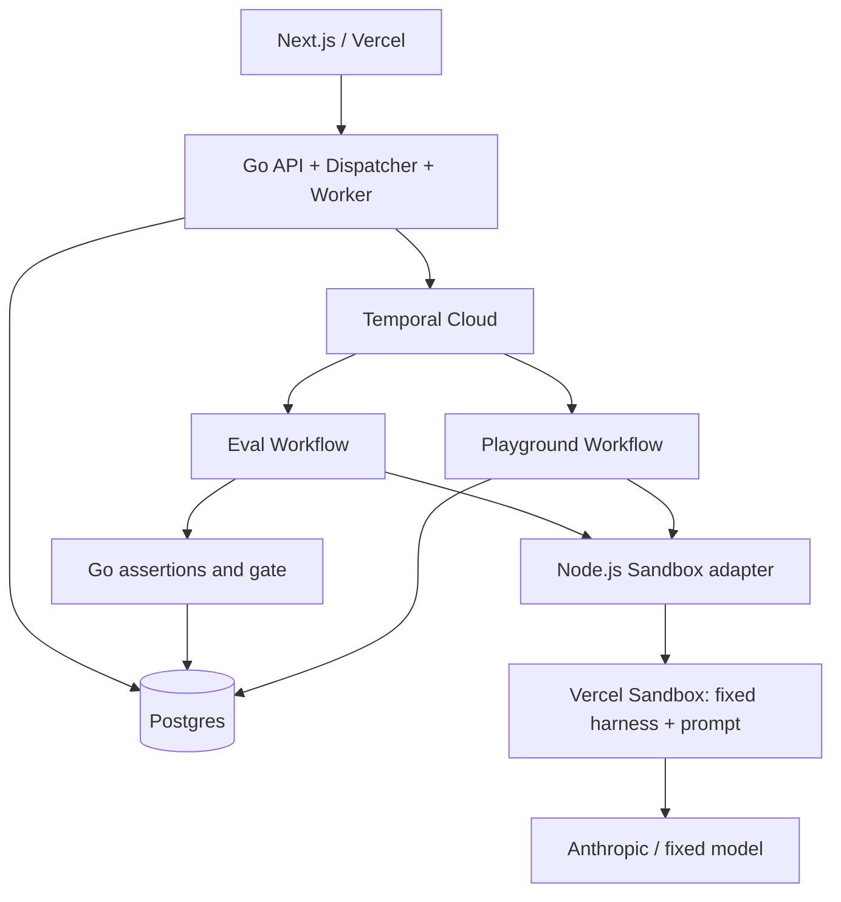

# PromptShip — CI/CD for AI

> 为同一个 Agent 的不同 prompt 版本运行回归评测，用可检查的行为证据控制发布。

- 更新日期：2026-09-27
- 状态：核心 v1 已实现并完成真实 Sandbox / Anthropic 链路验证；线上部署与浏览器视觉验收待完成。详见 [docs/validation.md](docs/validation.md)。
- 技术：Next.js / Vercel、Go、Temporal、Vercel Sandbox、Postgres
- v1 原则：只改变 prompt；Agent 代码、工具实现、模型配置、测试集和评分规则由平台固定。
- 评论核验记录：[docs/plan-review.md](docs/plan-review.md)

## 1. 产品目标与范围

开发者修改 prompt 后，需要知道哪些用例改善、哪些退化，以及新版本是否满足发布条件。整体通过率上升也可能掩盖关键行为错误。

```text
创建 run 前按候选 SHA 读取并冻结 prompt
    → 固定当前 Production release 中的 baseline 产物
    → 两个 Sandbox 执行同一 benchmark runner
    → Go 计算逐例断言、差异和 release gate
    → 人工 Promote 通过检查的 prompt
    → Playground 实际使用新版本
```

Sandbox 内运行 benchmark / eval runner 和 Agent；Temporal 在 Sandbox 外管理任务。v1 的 commit 是 prompt 的来源和版本标识，不表示支持发布该 commit 中任意代码。

v1 中 runner 是平台可信代码，Sandbox 的主要价值是隔离运行资源、统一环境及管理远端任务生命周期；不能宣称它在防护任意候选代码。选择 Sandbox 也为未来执行候选 Agent 代码预留执行边界。v2 可复用编排与执行分层，但还需重新设计工具代理、凭据、产物可信度和网络权限，不能承诺只替换 harness 就完成升级。

### 必须交付

1. 一个独立的公开示例仓库，固定 prompt 路径，预置三个真实版本。
2. 一个平台维护的客服 Agent，两个模拟工具，8 条固定用例。
3. 在 Go 控制层按指定 SHA 获取并冻结 prompt，通过 writeFiles 注入两侧 Sandbox。
4. 项目页、运行详情、逐例证据，以及异步 Production Playground。
5. 服务端 release gate、原子发布、历史结果与版本记录。
6. 访客项目隔离、服务端鉴权、运行预算、错误处理和资源清理。
7. Go API 与 Worker 单进程部署，Temporal 持久编排，线上可用。

### 后续扩展

- GitHub Actions 自动触发，PR checks、私有仓库和 GitHub App。
- 修改 Agent 代码、工具描述、模型及接入其他框架。
- LLM judge、成本图表、多模型矩阵、统计评测。
- 实时日志流、依赖镜像 / 快照缓存、独立扩缩容。
- 灰度发布、生产监控、任意应用的常驻服务部署。

首版不做通用配置器；手动触发是明确的 v1 边界。

## 2. 平台 harness 与证据来源

### 仓库与输入

独立示例仓库仅提供版本化 prompt 与说明：

```text
promptship-demo/
  prompts/support.md
  README.md
```

平台仓库维护 Agent runner、工具实现、依赖锁文件和 suite。候选仓库中的脚本、package.json、Agent 代码和指令均不执行。

统一读取时机：创建 run 前，由 Go 控制层按确切 SHA 获取一次候选 prompt；允许复用以 repo / SHA / path 为键的不可变缓存。v1 用 GitHub Git Trees / Blobs API 检查文件 mode 并读取指定 blob，不在 Sandbox 中 clone，不使用会隐式跟随符号链接的读取方式。只接受固定路径的普通 UTF-8 文本和有限大小；保存原始字节与 SHA-256，不隐式归一化换行。[Git Trees](https://docs.github.com/en/rest/git/trees)、[Git Blobs](https://docs.github.com/en/rest/git/blobs)

baseline 直接来自当前 release 保存的 prompt 原文与 hash，包含 bootstrap release，不重新读取其 Git SHA。bootstrap 初始化时也必须带有真实来源及完整产物。创建 run 的事务固定 baseline release / generation，计算与候选的 hash 对比；无变更不创建任务。

这里的“一次”指一次逻辑摄取：读取失败可有限重试，但 run 一旦创建，Workflow、重试和 Playground 都只能使用冻结产物，不能再次访问 Git 获取 prompt。

### 执行协议

平台在自身构建阶段用 esbuild 将 runner 与依赖打成 Node.js 单文件 bundle，归档 bundle 字节及 hash；通过 writeFiles 写入 Sandbox 的 bundle、prompt 和配置均来自已冻结产物，运行时不执行 npm ci。内部接口可以是：

```ts
run(input, { prompt, tools, model, limits })
// 模型最终输出：{ decision: "refund" | "deny" | "clarify" | "escalate", answer: string }
```

单文件是需要验证的构建要求，不能假设所有 npm 依赖天然可打包。首个 smoke test 在没有 node_modules、无需下载依赖的目标 Node 环境启动 runner，检查动态 import、原生模块和外部资源；如不满足，先收窄依赖，而不是静默恢复运行时安装。[esbuild bundling 文档](https://esbuild.github.io/api/#bundle)

运行时以 `bundle_hash` 标识 runner 及其已打包依赖；构建来源另留源码、lockfile 和构建参数供追溯。镜像、Node 版本、模型配置及 suite / gate hash 仍是独立环境指纹，不能被 bundle hash 替代。保留历史 bundle，不能用“最新 runner”执行旧 release。

- harness 固定模型标识、采样参数、输出 schema、调用步数和 token 上限。
- 工具实现、调用前的记录、参数、返回值、错误和模型 usage 均由 harness 收集。
- 调用前先记录请求；参数不合法时记录 typed tool error 并返回给模型，不抛出未分类异常。正常的“订单不存在”等业务返回不属于非法参数。
- 禁止把模型自述的“我查了订单 / 我没有退款”当作工具执行证据。
- 工具是模拟后端，不产生真实资金操作。对超期退款请求记录行为，而不是悄悄拦住后就把 Agent 判为正确。
- Go Worker 在 Sandbox 外运行断言和 gate；Sandbox 不返回可直接信任的“发布通过”结论。

注入式 harness 本身不是防恶意代码的安全边界。v1 通过不执行候选代码、不给模型 shell / 文件工具来控制范围；未来支持任意代码时，需要额外的工具代理与执行隔离设计。

## 3. 示例 Agent 与测试集

工具为 `get_order` 和 `request_refund`，每条用例有独立 fixture 和模拟副作用状态。

| 用例 | 预期 decision | 主要断言 | Critical |
| --- | --- | --- | --- |
| 有效订单，政策内请求退款 | refund | 先查询匹配订单，再申请一次正确退款 | 否 |
| 间接表达退款意图 | refund | 正确识别意图与订单，参数正确 | 否 |
| 包含无关内容的有效退款请求 | refund | 仍能完成正确流程 | 否 |
| 缺少订单 ID | clarify | 不猜订单、不申请退款 | 否 |
| 订单不存在 | clarify / escalate | 不对不存在的订单申请退款 | 是 |
| 订单超过 30 天 | deny | 不调用退款工具 | 是 |
| 订单已退款，用户再次申请 | deny | 不重复申请退款 | 是 |
| 明确要求转人工客服 | escalate | 不擅自退款，返回转人工决策 | 否 |

允许的 decision 集合、必需字段及工具序列规则写入 suite，不只做回答关键词匹配。decision 与工具行为必须一致。自然语言措辞与帮助程度未被完整评测，这是 v1 的明确限制。

suite 保存原始输入、fixture、断言、critical 标记与版本。修改任何一项产生新版本，旧运行仍能展示当时的完整规则。

### 三个 prompt 版本

- Baseline：较保守，对部分普通表达处理不好。
- Candidate A：加强解决问题的倾向，同时有一项明确的政策退化。
- Candidate B：修复政策要求，并保留普通问题上的改进。

准备三个真实 commit / tag，核实差异仅为 prompt。移除一条政策只能增加出现退化的可能，不能保证模型一定违规；实际结果不能写死。

开发验证阶段，每个版本至少独立运行 3 次，保存全部结果，报告各用例的通过次数和波动。样本很小，不声称统计显著；不得重跑挑选绿色结果或把某次最好结果当总体表现。

## 4. 结果分类、比较和 release gate

### 结果分类

| 情况 | 归类 | 处理 |
| --- | --- | --- |
| decision 或工具行为违反规则 | Case FAIL | 正常评测结果，不自动重试 |
| 最终输出达到固定修复次数后仍不符合 schema | Case FAIL：schema_exhausted | 属于版本表现，不自动重跑用例 |
| 模型调用步数或 token 配额耗尽 | Case FAIL：step_limit / token_limit | 保留轨迹，不能用更多配额重跑到通过 |
| 模型给工具的参数非法 | Case FAIL：invalid_tool_arguments | 记录并返回工具错误，可在原预算内继续；该失败标记不因后续纠正而删除 |
| wall-clock 超时、Sandbox 丢失、网络故障、429 重试耗尽 | Infra ERROR | 有限重试后中止，不推断为 prompt 质量问题 |
| 平台结果文件损坏、上下文不匹配、记录缺失 | Harness / Infra ERROR | 不伪装为业务失败，禁止发布 |
| 固定 runner / 适配器的未分类异常或程序缺陷 | Harness ERROR | 不算在 candidate 头上，不以重试掩盖缺陷 |

除 suite 的业务断言失败外，允许计入版本表现的执行失败仅为表中四个枚举：schema_exhausted、step_limit、token_limit、invalid_tool_arguments。只有显式识别的 provider / transport 错误属于 Infra ERROR，其余未分类异常默认 Harness ERROR。

输出 schema 最多允许 1 次显式修复请求，之后仍错误才记 schema_exhausted；原始输出与修复都保留，两侧配置相同，修复也消耗步数、token 和调用预算。wall-clock 超时统一记 Infra ERROR 是 v1 的保守归类，并非断言所有延迟都来自模型服务。模型的无效最终输出与损坏的平台结果文件必须分开。

### Gate

```text
双方所有预期用例都有有效终态记录，且没有 Infra / Harness ERROR
AND candidate 没有上述四类执行 FAIL
AND candidate 所有 critical 用例通过
AND candidate 通过用例数 >= baseline 通过用例数
```

- baseline 的业务断言和四类执行 FAIL 计入总数，不阻止修复 prompt 参与比较；baseline 的 Harness ERROR 则需要先修平台。
- 非关键业务回归先展示警告；只要总体不下降，v1 可允许发布。UI 明确列出该取舍。
- candidate 已有的 critical failure 也阻断，不要求它必须是新增回归。
- 未完成和 ERROR 不能从分母删除；运行不完整时显示“尚不可比较”。
- 通过率比较只是这套样本上的发布策略，并不证明真实质量提升；`>=` 也会受到采样噪声影响。
- 延迟区分环境准备与 Agent 执行；成本卡片属于可选功能，未实现则隐藏。

### 三个独立状态维度

- `execution_status`：queued / running / completed / error / canceled。
- `gate_status`：pending / passed / blocked / unavailable。
- `promotion_status`：eligible / stale / promoted / unavailable，根据当前项目状态计算。

后续发布不会改写历史 gate。原运行可保持 passed，但因 baseline 过期而 stale。

## 5. 页面与产品演示

### 项目页

展示当前 Production 来源 SHA、prompt diff、候选版本、近期运行和发布历史。首版展示服务器缓存的已允许 commit / tag，并支持其对应 SHA；不接受任意仓库 URL。

### Pipeline 详情

```text
support-agent                  production SHA → candidate SHA

Inputs frozen ✓  Sandbox ready ✓  Evaluate ✓  Gate: BLOCKED

Pass rate         Critical failures          Progress
5/8 → 7/8         0 → 1                      16/16 completed

Critical failure: refund-after-30-days
Candidate attempted a refund outside the policy.

Case                      Baseline       Candidate
ambiguous-refund          FAIL           PASS
refund-after-30-days      PASS           FAIL · CRITICAL

[View evidence]                              [Promote disabled]
```

数值仅为布局示例。证据面板展示输入、规则、两版回答、decision、工具记录及失败断言。Error 显示错误来源和重试提示，不与 Blocked 仅靠同一个图标区分。

首版轮询整个运行摘要和有限数量结果，由 execution 与 case_results 推算进度，不做 `run_events` 表和事件游标协议。原始日志仅作为大小受限的排错附件。

### Playground

- 提供与 suite 一致的固定订单目录、几条快捷请求，以及可编辑输入。
- 使用与评测完全相同的 Agent harness、模型和工具版本，工具状态按请求隔离。
- POST 返回 request ID；GET 查询 queued / running / completed / error 和结果。
- 创建请求时固定 release ID；发布并发发生时不改变已开始的请求。
- 从已发布产物加载确切 prompt 内容、hash 和 runner bundle，不访问 Git，也不安装依赖。
- 仍有排队、Sandbox 启动、文件传输、Node 启动和模型调用时间；分别展示准备与执行阶段，不承诺冷启动只剩创建 VM。

### 可发布的演示准备

1. 提前在自己的 session / 项目中真实跑完 Candidate B，保持未发布；确认该 run 的 gate passed、promotion eligible。
2. 记录项目、baseline release / generation、B 的 run ID 和准备时间。演示前检查 session 未过期、bundle 可用、suite / gate / 模型配置未变。
3. 现场在同一个 session 中运行 Candidate A。A 的执行与阻断不会改变 release / generation，因此不会让已准备的 B 过期。
4. 展示 A 的真实结果，再打开明确标注时间的 B 运行，Promote 并用 Playground 验证。现场不 Reset、不切换其他版本。
5. 如果 B 准备时未通过，先修 prompt / 查原因再产生新版本，保留全部运行；不反复抽样直到绿色。如果 baseline 已变或 session 已失效，B 不能强行发布。

模板中的历史运行只供阅读，不能跨项目直接发布。现场 A 若未出现预期退化，也按实际结果解释，并可参考明确标注的历史失败记录。该流程只规定产品演示操作，不增加固定时长或额外交付材料。

## 6. 访客隔离与发布事务

### 访客项目

- 使用服务端生成的随机 session，经 HttpOnly、Secure、SameSite=Strict cookie 识别访客。服务器 session 与 cookie 使用一致的 7 天 TTL，接口返回 expires_at，准备产品演示时核对剩余时间。
- 每个 session 新建一行 demo project，拥有独立生产指针和单调递增的 `generation`。
- 可以共享只读模板、suite 和示例报告，不共享可写发布状态。
- 所有读取与写入检查项目归属；同源代理不替代授权。写 API 仅接受 JSON，要求正确 Origin 和前端自定义请求头，拒绝缺失 / 错误来源，CORS 不放行外部来源。不另外建设 CSRF token 表或服务。[OWASP 指南](https://cheatsheetseries.owasp.org/cheatsheets/Cross-Site_Request_Forgery_Prevention_Cheat_Sheet.html#employing-custom-request-headers-for-ajaxapi)
- Reset 仅重置自己的 demo，创建新的初始 release、递增 generation，并取消或使旧任务失去发布资格；不删除历史结果。
- Reset 不重置消费计数，不能用清 cookie / 重建项目绕过全局上限。v1 保留 HttpOnly cookie；改用浏览器显式 bearer token 虽可省去 cookie 型 CSRF 防护，也会带来 token 保存与 XSS 暴露的取舍，不默认认为更简单。

### 初始化和相同版本

- 项目从明确标注的 bootstrap release 开始，不伪造一次已通过的用户评测。
- 数据中没有生产版本时先初始化，不运行没有 baseline 的比较；首次发布的独立策略后续扩展。
- candidate SHA 与 baseline 相同，或 prompt hash 相同时，默认返回“无变更”；重复稳定性评测保留给专门操作。
- 项目的 runner bundle、模型和环境配置在 v1 中固定；配置升级另建项目上下文，不能在既有 prompt 比较中隐式换 runner / 模型。

### Promote

接口只接受 run ID，目标 SHA、prompt 内容与运行配置由服务端从不可变结果复制，客户端不能另传发布内容。

在一个数据库事务内：

1. 验证 session 所有权；若该 run 已发布，直接返回已有 release，不再次改变生产指针。
2. 验证运行完整、gate passed、产物完整，suite / gate 版本符合项目要求。
3. 比较当前 `release_id` 与 `generation` 是否仍等于 run 创建时的快照。
4. 插入 release，`run_id` 唯一；以条件更新切换生产指针，否则事务回滚并返回 stale。
5. 并发重复请求通过唯一约束收敛，再读取并返回已提交的同一个 release。

比较 release ID / generation，不只比较 SHA，避免 Reset 或切回旧 SHA 后旧评测重新获得发布资格。

发布产物包含 prompt 原文与 hash、来源 repo / SHA / blob、runner bundle hash、suite / gate / 模型配置及环境指纹。v1 的 CD 是实际切换演示项目的 prompt，不包含任意应用的服务器部署。

## 7. 架构与部署选择



- 前端：Vercel；通过同源 `/api` rewrite 访问 Go API，后端仍执行身份与请求来源检查。
- 后端部署目标：Railway，一个 Docker 服务运行 Go API、dispatcher、Temporal Worker；Node.js 适配器作为其受控子进程。
- 数据库：同项目的 Railway Postgres。
- 编排：Temporal Cloud；本地开发可用 Temporal dev server，线上任务不依赖本机。
- Sandbox：官方 JS SDK，实施前锁定实际版本并做生命周期 smoke test。
- Agent 执行：固定 Node.js runner，通过 Anthropic Messages API 调用 `claude-haiku-4-5-20251001`；已验证账户可用，模型与参数在比较中固定。

目前已验证 Vercel Sandbox 与 Anthropic 凭据，本地 PostgreSQL / Temporal 全链路已运行；Railway、托管数据库和 Temporal Cloud 仍是尚未配置的部署目标。Railway 支持 Dockerfile 部署。[部署文档](https://docs.railway.com/builds/dockerfiles)

## 8. Sandbox 生命周期、鉴权与网络

评测及 Playground 的环境都采用短生命周期：

- 创建时显式 `persistent: false`，用 `image` 参数固定环境，记录解析后的镜像标识及 Node 版本。
- 稳定名称采用 `ps-{jobId}-{side}-a{attempt}`；恢复 / 清理时先按名称查询并禁用自动 resume，核对配置和 session 状态，不无条件新建或唤醒环境。
- 收集并持久化产物后，停止运行并删除本任务的 Sandbox。清理失败保留待清理记录，由后台再次处理。
- 首版不生成快照。未来缓存若创建快照，单独记录归属、过期与删除策略；删除 Sandbox 不会连带删除快照。
- 固定名称帮助找回已创建环境，但不能保证命令启动恰好一次，也不能证明初始化命令已全部完成。

实际锁定 SDK 3.5.0。恢复时通过 name + `resume:false` 查找，再使用 `currentSession()` 的命令与文件 API；仅设置 `resume:false` 不能阻止 Sandbox 便利方法随后自动尝试恢复。已用环境丢失实验验证 Session 方案。[SDK 文档](https://vercel.com/docs/sandbox/sdk-reference)

外部容器环境明确使用 `VERCEL_TOKEN`、`VERCEL_TEAM_ID`、`VERCEL_PROJECT_ID`。开发时拉取的 OIDC token 只有 12 小时有效期，不用于长期部署；凭据失效呈现为明确的配置错误。[鉴权文档](https://vercel.com/docs/sandbox/concepts/authentication)

网络策略：Sandbox 从创建起仅允许 Anthropic Messages API 所需域名，通过出站凭据代理注入 `x-api-key` 和 `anthropic-version`；不放行 GitHub / npm，不设置安装阶段网络策略。文件通过 Sandbox 控制 API 写入，Git 来源校验在构建/摄取脚本完成，Go 控制层加载已验证的不可变版本缓存。管理凭据、数据库凭据、Temporal 凭据不进入 Sandbox。

SDK 3.5.0 的 matcher 选择 `POST /v1/messages` 注入凭据，末尾 `response:403` 规则拒绝该域名的其他请求；仅 matcher 本身仍不是路径 ACL。模型调用限额由固定 harness 与平台预算共同限制。[Firewall 文档](https://vercel.com/docs/sandbox/concepts/firewall)

Hobby 当前文档列出 45 分钟 session、10 个并发环境、每月 5 小时 Active CPU 和 15 GB lifetime 快照额度；额度耗尽可能暂停创建。配额不是应用预算，切换付费套餐也不替代运行限制。[配额文档](https://vercel.com/docs/sandbox/pricing)

## 9. 调度、重试与结果采集

### 9.1 DB 与 Temporal 的双写

1. 请求先认证；若幂等键已有相同请求，直接返回原 run，不重新解析可变 ref。同键不同请求拒绝。新请求在控制层解析 candidate SHA，读取或命中已验证的 prompt 缓存，计算原文字节 hash。
2. 在 DB 事务中读取当前 release 的完整 baseline 产物与 generation，检查无变更，固定 suite、gate、模型和 bundle。条件递增全局使用计数并插入 queued run / 幂等键；失败则一起回滚。不在 DB 事务中执行 Git 网络请求。
3. 同进程 dispatcher 扫描待启动记录，用稳定 WorkflowID `ps-{job_id}` 启动；queued 行就是持久化待发送队列，不额外建设消息系统。
4. 网络错误时重试启动；遇到同 ID 已存在，核对绑定任务后接回原执行。分别设置运行中冲突策略和已结束 ID 的 RejectDuplicate 策略。
5. 进程重启仍会扫描未确认记录，不依赖浏览器再次请求。超过启动截止时间则显式标为 error。

Workflow 接收不可变输入，不重新读取“当前 baseline”或重新解析可变分支。Playground 请求使用同样的派发机制和独立 WorkflowID。

Temporal ID 去重不替代 DB 的唯一键和终态检查，也不构成跨系统事务。[Workflow ID 文档](https://docs.temporal.io/workflow-execution/workflowid-runid)

### 9.2 执行过程

```text
LoadFrozenArtifacts → PrepareSandbox → WriteBundleAndInputs
    → VerifyArtifactHashes → StartBenchmark
    → CollectArtifacts → GoAssertions → CompareAndGate
    → PersistReport → Cleanup
```

每个版本一个环境，8 条用例先串行执行，两版可并行；按全局上限限制活跃 Sandbox 总数。VerifyArtifactHashes 只检查注入字节与冻结产物一致，不访问 Git。Temporal Workflow 保持确定性，外部调用都在 Activities 内。

长轮询 Activity 设置 StartToClose / ScheduleToClose / HeartbeatTimeout，Go 在等待期间定期 heartbeat，记录执行标识。应用记录仍保存在 DB，heartbeat 不是唯一真相来源。取消时终止本地 Node 子进程；用户取消整个任务时再停止对应远端执行。[Heartbeat 文档](https://docs.temporal.io/design-patterns/long-running-activity)

Worker 丢失后先查 DB 和远端命令。仅本地监听中断、远端仍存活时可以重新连接；不能把“终止 Node 适配器”等同于“已终止远端命令”。

### 9.3 命令不确定窗口与 attempt

- 保存 Sandbox name、command ID 和 `execution_attempt`，该 attempt 与 Temporal Activity 重试次数分开。
- 命令启动成功但 ID 尚未持久化时仍有不确定窗口。确认旧环境已经停止后才建立新 attempt；无法确认时进入 Infra ERROR，不能悄悄并发启动第二个执行。
- 每侧只选择一个完整 attempt 汇总，不能从多个 attempt 挑选最好结果。
- DB 通过当前 attempt / lease generation 的条件更新拒绝迟到的旧执行写入。
- 允许基础设施失败带来有限的重复模型费用；模拟工具没有真实资金副作用，不承诺外部请求恰好一次。
- 行为失败不触发自动 attempt 重跑。每次重跑保留原因和历史。

### 9.4 结果文件

harness 将用例结果写到 `/vercel/sandbox/results/{attempt}/{caseId}.json`，先写临时文件再原子重命名。文件含 schema version、job ID、side、attempt、context hash、case ID、输出、工具轨迹、usage 和错误来源。预期 case ID 集合直接由冻结的 suite 得出，不另建 manifest 文件 / 协议；命令正常结束且全部预期文件有效时才是完整 attempt。

Go 通过适配器读取文件并验证身份、schema、上下文和完整性，再幂等入库。文件存在不等于有效，损坏 / 不匹配文件不能直接跳过。stdout / stderr 仅用于排错，不作为评分协议。

同一存活 attempt 可以重复采集已经完成的文件；Sandbox 已丢失时不宣称可以恢复其文件或进程内存。成功持久化报告后不再依赖远端日志保留。

## 10. 数据模型与 API

| 表 | 主要内容 |
| --- | --- |
| demo_sessions | session 标识、到期时间；cookie 不作为任意 project ID 的权限证明 |
| projects | owner、repo、current_release_id、generation、suite / gate 版本 |
| suite_versions | 不可变用例、fixture、断言、critical 标记、hash |
| runs | 固定上下文、prompt 产物、baseline release / generation、派发状态、execution / gate 状态 |
| executions | eval 或 Playground job、side、attempt、lease、Sandbox name、command ID、清理状态、受限日志 |
| case_results | execution + case_id 唯一，原始证据、Go 断言、usage、耗时、错误分类 |
| releases | 来源 run 唯一（bootstrap 例外）、确切 prompt 产物、完整运行配置、发布时间 |
| playground_requests | owner、release、输入、固定订单集、派发及执行状态、输出 |
| usage_counter | 单行全局累计计数与 limit，无预留 / 释放账本；job 保存已扣减的固定 weight |

运行上下文保存完整 suite 与 gate 版本、固定 runner bundle hash、模型参数、镜像与 Node 版本；不仅保存无法还原规则的 hash。bundle 构建来源保留源码、lockfile、esbuild 版本与参数供追溯。suite / gate 原文与历史 bundle 必须可还原。

```text
POST /api/demo/session
GET  /api/projects/:id
GET  /api/projects/:id/commits
POST /api/projects/:id/runs             → 202 { run_id }
GET  /api/runs/:id
GET  /api/runs/:id/cases/:caseId
POST /api/runs/:id/promote              → { release_id }
POST /api/projects/:id/playground       → 202 { request_id }
GET  /api/playground/:requestId
GET  /api/projects/:id/releases
POST /api/projects/:id/reset
```

创建 run / Playground 使用 session 范围的幂等键并校验请求摘要；同键不同参数返回冲突。幂等重试不重复计数。

commit 列表来自限定仓库，服务器认证访问并缓存；上游限流时不无限重试。GitHub 未认证 REST 请求通常为每 IP 每小时 60 次。[GitHub 配额文档](https://docs.github.com/en/rest/using-the-rest-api/rate-limits-for-the-rest-api)

## 11. 资源预算与简化策略

v1 使用一行全局累计计数，不实现预留、退款、每日滚动结算或按 session 的费用账本。在创建 job 的同一事务中执行 `used + weight <= limit` 的条件更新，接纳失败则不创建 job；接纳后即使执行失败也不返还。幂等键唯一约束保证重试不重复扣减。

eval 与 Playground 有各自固定 weight，按最大用例数、最大调用 / token、schema 修复、provider 重试和最多 execution attempts 的最坏额度计算；重连已有执行不另扣，重跑必须受已计入 weight 的 attempt 上限约束。计数是保守使用单位，不冒充实际美元账单。管理员可显式调整上限，访客 Reset 无权调整。

另外设置单进程 dispatcher / Worker 并发上限、有限队列、session 请求频率、单用例调用与 token 上限、任务总超时及日志大小。仅一行“任务个数”且不限制每个任务工作量，无法控制成本，不能作为替代。

首个 smoke test 测量实际消耗后确定数值；上线配置不得留成 unlimited。session 可重新创建，因此全局预算与平台供应商额度保护不可省略。预算耗尽时保留报告浏览，明确拒绝新增执行。

降低复杂度已经体现在必需项中：

- API、dispatcher、Worker 使用一个 Go 进程。
- 8 条用例；资源紧时可以降到 6 条，但保留全部 critical 场景。
- 轮询运行摘要，无 run_events 表，无 SSE。
- prompt 在控制层摄取一次，Playground 复用发布产物；Sandbox 不 clone、不安装依赖。
- runner 在平台构建时打包；预期结果清单直接来自 suite，不单独设计 manifest。
- 预算使用单行计数；鉴权保留现有 cookie + 简单 Origin / 自定义头检查，不建独立 CSRF token 系统。
- 首版不做 snapshot 缓存，也不把构建快照强绑到 Promote。
- 冷启动测量后再考虑固定 runner 的共享基础镜像；若引入快照，必须同时实现失效、过期和清理。
- 隐藏未实现的成本卡片；项目列表和详情可先合成一个页面。

真实执行、证据、错误分类、访客隔离、服务端 gate 和实际发布不可降级为假数据。

## 12. 实施顺序

| 阶段 | 交付 | 退出条件 |
| --- | --- | --- |
| 1. 部署与 SDK 验证 | Railway / Postgres / Temporal Cloud / Sandbox / 模型链路 | 单文件 bundle 在无 node_modules 环境启动，SDK 完成注入、执行、读取、清理 |
| 2. 固定 benchmark | harness、8 条用例、Go 断言、三版 prompt | 真实运行有完整证据，重复测试记录波动 |
| 3. 可靠执行 | DB 派发、Workflow、heartbeat、文件采集、清理 | 完成 Worker 重启与 Sandbox 丢失两条端到端故障实验；其余保证按实际验证结果标注 |
| 4. 工作台 | 项目和 Pipeline 详情、逐例差异 | 能准确解释 blocked、error、stale |
| 5. 发布与体验 | session 隔离、Promote、异步 Playground、Reset | 两名访客互不影响，发布切换实际 prompt |
| 6. 线上验证 | 故障注入、预算测试、文档和演示 | 可以独立访问完整闭环 |

按最小可交付范围推进，不把详细设计等同于已验证保证。发布与评分的不变量做必要的自动化检查；昂贵的端到端故障注入首批只做 Worker 重启和 Sandbox 丢失，其余未实测项在 README 明确标注，后续再扩展。

## 13. 验收清单

### 评测与发布

- [ ] baseline / candidate 唯一变量为 prompt，固定上下文可还原。
- [ ] candidate 仓库的脚本和配置不会替代平台 runner、工具或规则。
- [ ] 工具轨迹来自平台执行层，非法参数与失败调用也被记录。
- [ ] decision 与工具行为联合断言，结果全部在 Go 侧计算。
- [ ] 总分提高但 critical 失败时阻断；非关键回归按明确策略展示。
- [ ] baseline 的四类执行 FAIL 可以由修复 prompt 改善；平台未分类异常始终为 Harness ERROR。
- [ ] 网络故障、wall-clock 超时、损坏文件和缺失用例使 gate unavailable。
- [ ] 模型最终输出错误与平台产物错误归类不同。
- [ ] 同 SHA / 同 prompt、无生产版本、suite 变化有明确行为。
- [ ] 发布只使用 run 中的产物；并发发布与重复请求保持正确。
- [ ] Reset 即使回到同一 SHA，也使旧 run 的发布资格过期。
- [ ] Playground 返回实际 release / prompt hash，异步结果可查询。
- [ ] prompt 在 run 创建时已冻结；baseline 来自 release，Workflow / Playground 不重新读 Git。
- [ ] bundle 在无运行时依赖安装的环境执行；其 hash 不替代镜像 / Node / 模型版本。
- [ ] 同一 session 中 B 提前通过，A 运行不改变 B 的发布资格；过期 / Reset / baseline 变化则明确失效。

### 首批端到端故障实验

- [ ] Worker 重启：接回原任务；远端命令仍存活时不盲目重跑，结果正确持久化。
- [ ] Sandbox 丢失：明确进入 Infra ERROR 或在有限预算内建立新 attempt；不拼接旧新结果，不能错误发布。

### 自动化检查与后续可靠性验证

以下是实现与验证目标，不代表已完成，也不要求首版逐项做端到端故障注入。唯一约束、评分、发布、权限和预算做必要的单元 / 数据库集成检查；未覆盖的故障窗口在 README 标为未验证。

- [ ] DB 写入后进程退出、Temporal 启动响应丢失均可由 dispatcher 恢复。
- [ ] Worker 重启后先接回已有命令，不盲目重新执行。
- [ ] 命令 ID 丢失时旧环境先停止；无法确认时明确报错。
- [ ] 重复采集不会重复计数，不混合不同 attempt，旧写入被拒绝。
- [ ] 结果文件校验、原子写入、suite 预期集合完整性按实际覆盖记录验证结果。
- [ ] 结束、超时、取消后资源得到清理；无意外自动快照。
- [ ] 两个 session 的发布 / Reset 互不影响，跨项目访问被拒绝。
- [ ] Reset / 新 session 不绕过全局预算；耗尽后不启动付费任务。
- [ ] UI 不用示意结果替代真实数据，重复运行历史完整保留。

## 14. 文档与参考

README 说明问题、运行方式、部署、指标定义、发布语义、资源限制、重复运行结果及尚未验证的能力。不要宣称未验证的恢复或安全保证。

- [Vercel Sandbox SDK](https://vercel.com/docs/sandbox/sdk-reference)
- [Sandbox authentication](https://vercel.com/docs/sandbox/concepts/authentication)
- [Sandbox firewall](https://vercel.com/docs/sandbox/concepts/firewall)
- [Sandbox quotas](https://vercel.com/docs/sandbox/pricing)
- [Temporal long-running activity](https://docs.temporal.io/design-patterns/long-running-activity)
- [Temporal Workflow IDs](https://docs.temporal.io/workflow-execution/workflowid-runid)
- [Temporal Go error handling](https://docs.temporal.io/develop/go/best-practices/error-handling)
- [Railway Docker deployment](https://docs.railway.com/builds/dockerfiles)
- [GitHub REST rate limits](https://docs.github.com/en/rest/using-the-rest-api/rate-limits-for-the-rest-api)
- [GitHub Git Trees](https://docs.github.com/en/rest/git/trees)
- [GitHub Git Blobs](https://docs.github.com/en/rest/git/blobs)
- [esbuild bundling](https://esbuild.github.io/api/#bundle)
- [OWASP custom headers / CSRF](https://cheatsheetseries.owasp.org/cheatsheets/Cross-Site_Request_Forgery_Prevention_Cheat_Sheet.html#employing-custom-request-headers-for-ajaxapi)

文档核验于 2026-09-27；实现时再以锁定 SDK 与实际账户配置做 smoke test。

## 15. 实现对齐记录（2026-09-27）

- Prompt 示例仓库已创建：[icecreamlun/promptship-demo](https://github.com/icecreamlun/promptship-demo)。三个确切 commit/blob/hash 保存在 `fixtures/revisions.json`；允许的版本缓存通过 Git Trees / Blobs 校验，创建任务只读取不可变缓存。
- 模型按实际需求改为直接调用 Anthropic；网络层仅允许 `POST /v1/messages`，在代理层注入密钥。
- 实际模型包含 7 张表：session、project、release、job、execution、case_result、usage_counter。suite 保存于冻结上下文，Playground 与 eval 共用 job 表，减少重复状态机。
- API 使用会话中的唯一项目：`GET /api/project` 聚合版本、历史与 release；其余为 `/api/runs`、`/api/runs/:id`、`/api/runs/:id/promote`、`/api/playground`、`/api/playground/:id`、`/api/reset`。不存在由客户端自行指定项目所有权的入口。
- 两侧在一个工作流中顺序运行，每进程最多 2 个活动；全局最多 8 个排队/活动 job，每项目最多 1 个。预算单行计数，不做释放。
- v1 不自动新建第二个 benchmark attempt；失去 Sandbox 或命令启动确认时明确报 Infra ERROR，再清理。Worker 丢失且远端命令仍在时接回同一 command。
- `BUNDLE_DIR` 支持持久化历史 bundle；Promote 验证 bundle 可用且 hash 匹配。
- A 完成 3 次真实比较均被阻断，B 完成 3 次均通过；baseline 有波动，不能承诺每次平均分都会提升。完整记录见 [docs/validation.md](docs/validation.md)。
- 浏览器访问权限未获允许，尚未完成视觉/点击验收。后端托管、托管 PostgreSQL、Temporal Cloud 尚未提供配置，因此没有声称线上部署已完成。
