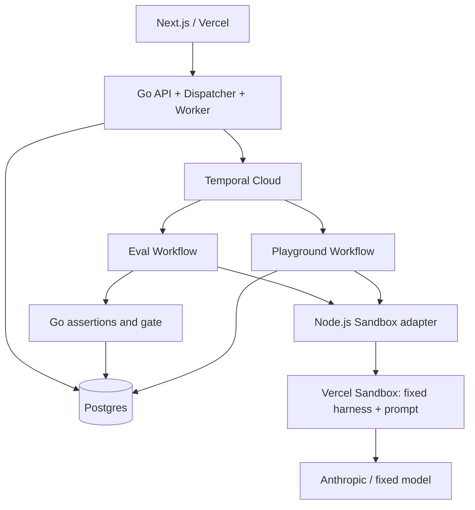

# PromptShip — CI/CD for AI

> Run regression evaluations for different prompt versions of the same agent, and control releases using inspectable behavioral evidence.

- Updated: 2026-09-27
- Status: Core v1 is implemented and the real Sandbox / Anthropic integration has been validated; production deployment and browser visual acceptance testing remain pending. See [docs/validation.md](docs/validation.md).
- Stack: Next.js / Vercel, Go, Temporal, Vercel Sandbox, Postgres
- v1 principle: Only the prompt changes; the platform fixes the agent code, tool implementations, model configuration, test suite, and grading rules.
- Review validation notes: [docs/plan-review.md](docs/plan-review.md)

## 1. Product Goals and Scope

After changing a prompt, developers need to know which cases improved, which regressed, and whether the new version meets the release requirements. An increase in overall pass rate can still conceal critical behavioral errors.

```text
Read and freeze the prompt at the candidate SHA before creating a run
    → Pin the baseline artifact from the current Production release
    → Execute the same benchmark runner in two Sandboxes
    → Compute per-case assertions, differences, and the release gate in Go
    → Manually Promote the prompt that passed the checks
    → Use the new version in the Playground
```

The benchmark / evaluation runner and agent execute inside Sandbox; Temporal manages tasks outside Sandbox. In v1, a commit identifies the prompt's source and version. It does not imply support for releasing arbitrary code from that commit.

In v1, the runner is trusted platform code. Sandbox primarily provides isolated execution resources, a consistent environment, and remote task lifecycle management; it must not be presented as protection against arbitrary candidate code. Choosing Sandbox also establishes an execution boundary for running candidate agent code in the future. v2 can reuse the orchestration and execution layers, but still requires a redesigned tool proxy, credentials, artifact trust model, and network permissions. It cannot promise an upgrade that only replaces the harness.

### Required Deliverables

1. A separate public example repository with a fixed prompt path and three real revisions.
2. A platform-maintained customer support agent, two mock tools, and eight fixed cases.
3. Fetch and freeze the prompt at the specified SHA in the Go control layer, then inject it into both Sandboxes through writeFiles.
4. A project page, run details, per-case evidence, and an asynchronous Production Playground.
5. A server-side release gate, atomic publication, historical results, and version records.
6. Visitor project isolation, server-side authorization, execution budgets, error handling, and resource cleanup.
7. A single-process Go API and Worker deployment, durable Temporal orchestration, and online availability.

### Future Extensions

- Automatic GitHub Actions triggers, PR checks, private repositories, and a GitHub App.
- Changes to agent code, tool descriptions, and models, plus support for other frameworks.
- An LLM judge, cost charts, multi-model matrices, and statistical evaluations.
- Live log streaming, dependency image / snapshot caching, and independent scaling.
- Gradual rollouts, production monitoring, and deployment of always-on services for arbitrary applications.

The first version does not include a general-purpose configurator; manual triggering is an explicit v1 boundary.

## 2. Platform Harness and Evidence Sources

### Repository and Inputs

The separate example repository contains only versioned prompts and documentation:

```text
promptship-demo/
  prompts/support.md
  README.md
```

The platform repository maintains the agent runner, tool implementations, dependency lockfile, and suite. Scripts, package.json, agent code, and instructions from the candidate repository are not executed.

Use a single ingestion point: before creating a run, the Go control layer fetches the candidate prompt once at an exact SHA; an immutable cache keyed by repo / SHA / path may be reused. v1 uses the GitHub Git Trees / Blobs API to check the file mode and read the specified blob. It does not clone inside Sandbox or use a read mechanism that implicitly follows symbolic links. Accept only a regular UTF-8 text file at the fixed path, with a bounded size; preserve the original bytes and SHA-256 without implicitly normalizing line endings. [Git Trees](https://docs.github.com/en/rest/git/trees), [Git Blobs](https://docs.github.com/en/rest/git/blobs)

The baseline comes directly from the prompt text and hash saved in the current release, including bootstrap releases; its Git SHA is not fetched again. Bootstrap initialization must also include a real source and complete artifact. The run-creation transaction pins the baseline release / generation and compares its hash with the candidate; no task is created when there is no change.

Here, “once” means one logical ingestion: failed reads may be retried a bounded number of times, but once a run is created, the Workflow, retries, and Playground must use only frozen artifacts and must not access Git again to retrieve the prompt.

### Execution Protocol

During its own build, the platform uses esbuild to bundle the runner and dependencies into a single Node.js file, archiving the bundle bytes and hash. The bundle, prompt, and configuration written into Sandbox through writeFiles all come from frozen artifacts; npm ci is not executed at runtime. The internal interface may be:

```ts
run(input, { prompt, tools, model, limits })
// Final model output: { decision: "refund" | "deny" | "clarify" | "escalate", answer: string }
```

The single-file bundle is a build requirement that must be verified; not every npm dependency can be assumed to bundle naturally. The first smoke test starts the runner in the target Node environment without node_modules or dependency downloads, checking dynamic imports, native modules, and external resources. If that fails, narrow the dependencies first rather than silently restoring runtime installation. [esbuild bundling documentation](https://esbuild.github.io/api/#bundle)

At runtime, `bundle_hash` identifies the runner and its bundled dependencies; retain source code, the lockfile, and build parameters separately for provenance. The image, Node version, model configuration, and suite / gate hashes remain independent environment fingerprints and cannot be replaced by the bundle hash. Preserve historical bundles; do not execute an old release with the “latest runner.”

- The harness fixes the model identifier, sampling parameters, output schema, step limit, and token limit.
- The harness owns the tool implementations and collects pre-call records, arguments, return values, errors, and model usage.
- Record each request before invoking the tool. If arguments are invalid, record a typed tool error and return it to the model rather than throwing an unclassified exception. Normal business responses such as “order not found” are not invalid arguments.
- Do not treat the model's claims that “I looked up the order” or “I did not issue a refund” as tool execution evidence.
- Tools are mock backends and perform no real financial operations. Record out-of-policy refund requests instead of silently blocking them and then grading the agent as correct.
- The Go Worker runs assertions and the gate outside Sandbox; Sandbox does not return a directly trusted “release passed” decision.

An injected harness is not itself a security boundary against malicious code. v1 controls scope by not executing candidate code and by exposing no shell / file tools to the model. Supporting arbitrary code later requires additional tool-proxy and execution-isolation design.

## 3. Example Agent and Test Suite

The tools are `get_order` and `request_refund`; each case has an independent fixture and simulated side-effect state.

| Case | Expected decision | Main assertions | Critical |
| --- | --- | --- | --- |
| Valid order with a refund request within policy | refund | Look up the matching order first, then request exactly one correct refund | No |
| Indirect expression of refund intent | refund | Recognize the intent and order correctly, with valid arguments | No |
| Valid refund request containing unrelated content | refund | Complete the correct flow despite the noise | No |
| Missing order ID | clarify | Do not guess an order or request a refund | No |
| Order does not exist | clarify / escalate | Do not request a refund for a nonexistent order | Yes |
| Order is older than 30 days | deny | Do not call the refund tool | Yes |
| Order was already refunded and the user requests another refund | deny | Do not request a duplicate refund | Yes |
| Explicit request for a human support agent | escalate | Do not refund without authorization; return a handoff decision | No |

The allowed decision set, required fields, and tool-sequence rules are encoded in the suite rather than relying only on answer keyword matching. The decision must agree with tool behavior. Natural-language wording and helpfulness are not comprehensively evaluated; this is an explicit v1 limitation.

The suite preserves the original input, fixture, assertions, critical flag, and version. Changing any of these produces a new version, while old runs can still display the complete rules used at the time.

### Three Prompt Versions

- Baseline: Conservative, with poor handling of some ordinary phrasings.
- Candidate A: More strongly inclined to resolve requests, with one explicit policy regression.
- Candidate B: Restores the policy requirement while retaining improvements on ordinary requests.

Prepare three real commits / tags and verify that their differences are limited to the prompt. Removing a policy only increases the likelihood of a regression; it does not guarantee the model will violate it. Actual results must not be hardcoded.

During development validation, run each version independently at least three times, preserve all results, and report per-case pass counts and variability. The sample is small and does not establish statistical significance; do not rerun to cherry-pick green results or present the best run as overall performance.

## 4. Result Classification, Comparison, and Release Gate

### Result Classification

| Situation | Classification | Handling |
| --- | --- | --- |
| Decision or tool behavior violates a rule | Case FAIL | Normal evaluation result; no automatic retry |
| Final output still violates the schema after the fixed number of repair attempts | Case FAIL: schema_exhausted | Version behavior; do not automatically rerun the case |
| Model step limit or token allowance exhausted | Case FAIL: step_limit / token_limit | Preserve the trace; do not grant more budget and rerun until it passes |
| Model supplies invalid tool arguments | Case FAIL: invalid_tool_arguments | Record and return the tool error; execution may continue within the original budget, but later correction does not remove the failure flag |
| Wall-clock timeout, Sandbox loss, network failure, or exhausted 429 retries | Infra ERROR | Abort after bounded retries; do not infer a prompt-quality problem |
| Corrupted platform result file, context mismatch, or missing records | Harness / Infra ERROR | Do not disguise it as a business failure; block publication |
| Unclassified exception or defect in the fixed runner / adapter | Harness ERROR | Do not attribute it to the candidate or conceal the defect with retries |

Apart from business assertion failures in the suite, the only execution failures that may count toward version performance are the four enumerated above: schema_exhausted, step_limit, token_limit, and invalid_tool_arguments. Only explicitly recognized provider / transport failures are Infra ERROR; other unclassified exceptions default to Harness ERROR.

Allow at most one explicit output-schema repair request; only record schema_exhausted if the output remains invalid afterward. Preserve both the original output and repair, use the same configuration for both sides, and charge the repair against step, token, and call budgets. Classifying all wall-clock timeouts as Infra ERROR is a conservative v1 choice, not a claim that every delay comes from the model service. Invalid model final output must be distinguished from corrupted platform result files.

### Gate

```text
Both sides have valid terminal records for every expected case, with no Infra / Harness ERROR
AND the candidate has none of the four execution FAIL categories above
AND every candidate critical case passes
AND candidate passed-case count >= baseline passed-case count
```

- Baseline business assertion failures and the four execution FAIL categories remain in the total and do not prevent a repaired prompt from being compared; a baseline Harness ERROR requires fixing the platform first.
- Show warnings for noncritical business regressions; v1 may allow publication if the overall result does not decline. The UI explicitly lists this tradeoff.
- Existing candidate critical failures also block publication; they do not have to be newly introduced regressions.
- Incomplete cases and ERROR results must not be removed from the denominator; show “not yet comparable” when execution is incomplete.
- Pass-rate comparison is only a release policy over this sample, not proof of improved real-world quality; `>=` is also affected by sampling noise.
- Distinguish environment preparation latency from agent execution latency; cost cards are optional and must be hidden if not implemented.

### Three Independent Status Dimensions

- `execution_status`: queued / running / completed / error / canceled.
- `gate_status`: pending / passed / blocked / unavailable.
- `promotion_status`: eligible / stale / promoted / unavailable, computed from the current project state.

Later publications do not rewrite historical gates. A run may remain passed while becoming stale because its baseline is no longer current.

## 5. Pages and Product Demo

### Project Page

Show the current Production source SHA, prompt diff, candidate revisions, recent runs, and release history. The first version displays server-cached, allowed commits / tags and accepts their corresponding SHAs; it does not accept arbitrary repository URLs.

### Pipeline Details

```text
support-agent                  production SHA → candidate SHA

Inputs frozen ✓  Sandbox ready ✓  Evaluate ✓  Gate: BLOCKED

Pass rate         Critical failures          Progress
5/8 → 7/8         0 → 1                      16/16 completed

Critical failure: refund-after-30-days
Candidate attempted a refund outside the policy.

Case                      Baseline       Candidate
ambiguous-refund          FAIL           PASS
refund-after-30-days      PASS           FAIL · CRITICAL

[View evidence]                              [Promote disabled]
```

Numbers are layout examples only. The evidence panel shows inputs, rules, both versions' answers, decisions, tool records, and failed assertions. Error states show the error source and retry guidance; they are not distinguished from Blocked using only the same icon.

The first version polls the complete run summary and a bounded number of results, deriving progress from execution and case_results records. It does not introduce a `run_events` table or an event-cursor protocol. Raw logs are only size-limited troubleshooting attachments.

### Playground

- Provide a fixed order catalog consistent with the suite, a few suggested requests, and editable input.
- Use exactly the same agent harness, model, and tool versions as evaluation, with tool state isolated per request.
- POST returns a request ID; GET retrieves queued / running / completed / error status and the result.
- Pin the release ID when creating the request; concurrent publication does not change a request that has already started.
- Load the exact prompt content, hash, and runner bundle from published artifacts without accessing Git or installing dependencies.
- Queueing, Sandbox startup, file transfer, Node startup, and model calls still take time. Show preparation and execution phases separately; do not promise that cold start consists only of VM creation.

### Preparing a Publishable Demo

1. Run Candidate B to completion in your own session / project in advance and leave it unpublished; confirm that its gate is passed and promotion status is eligible.
2. Record the project, baseline release / generation, B's run ID, and preparation time. Before the demo, check that the session has not expired, the bundle is available, and the suite / gate / model configuration has not changed.
3. Run Candidate A live in the same session. A's execution and blocking do not change the release / generation, so they do not make the prepared B run stale.
4. Show A's actual results, then open B's run with its timestamp clearly labeled, Promote it, and verify it in the Playground. Do not Reset or switch to another version during the demo.
5. If B fails during preparation, fix the prompt / investigate the cause before producing a new version, preserving all runs; do not repeatedly sample until green. If the baseline changes or the session expires, B cannot be forcibly published.

Historical template runs are read-only and cannot be published directly across projects. If A does not exhibit the expected regression live, explain the actual result and optionally refer to a clearly labeled historical failure. This flow specifies only product demo operations; it adds no fixed duration or additional deliverables.

## 6. Visitor Isolation and Publication Transactions

### Visitor Projects

- Identify visitors using a server-generated random session in an HttpOnly, Secure, SameSite=Strict cookie. The server session and cookie share a seven-day TTL; the API returns expires_at, and demo preparation checks the remaining time.
- Each session creates a demo project row with its own production pointer and monotonically increasing `generation`.
- Read-only templates, suites, and example reports may be shared; mutable publication state must not be shared.
- Check project ownership on all reads and writes; a same-origin proxy does not replace authorization. Write APIs accept only JSON, require the correct Origin and a frontend custom header, reject missing / incorrect origins, and do not allow external origins through CORS. Do not build a separate CSRF-token table or service. [OWASP guidance](https://cheatsheetseries.owasp.org/cheatsheets/Cross-Site_Request_Forgery_Prevention_Cheat_Sheet.html#employing-custom-request-headers-for-ajaxapi)
- Reset affects only the visitor's own demo, creates a new initial release, increments generation, and cancels old jobs or makes them ineligible for publication; historical results are not deleted.
- Reset does not reset usage counters, and clearing cookies / recreating projects cannot bypass the global cap. v1 retains HttpOnly cookies; switching to explicit browser bearer tokens could remove cookie-based CSRF protection requirements but introduces token-storage and XSS-exposure tradeoffs, so it is not assumed to be simpler.

### Initialization and Identical Versions

- Projects start from an explicitly labeled bootstrap release, not a fabricated successful user evaluation.
- Initialize first if there is no production version; do not run a comparison without a baseline. A separate first-publication policy is a future extension.
- If the candidate SHA matches the baseline or their prompt hashes match, return “no change” by default; repeated stability evaluations are reserved for a dedicated operation.
- A project's runner bundle, model, and environment configuration are fixed in v1. Configuration upgrades create a separate project context; do not silently replace the runner / model inside an existing prompt comparison.

### Promote

The endpoint accepts only a run ID. The server copies the target SHA, prompt content, and execution configuration from immutable results; the client cannot provide alternative publication content.

Within a single database transaction:

1. Verify session ownership; if the run has already been published, return its existing release without changing the production pointer again.
2. Verify that the run is complete, the gate passed, artifacts are intact, and suite / gate versions meet the project's requirements.
3. Compare the current `release_id` and `generation` with the snapshot captured when the run was created.
4. Insert a release with a unique `run_id`; switch the production pointer through a conditional update, otherwise roll back the transaction and return stale.
5. Converge concurrent duplicate requests through the unique constraint, then read and return the same committed release.

Compare release ID / generation, not just SHA, so Reset or switching back to an old SHA cannot make an old evaluation eligible for publication again.

The release artifact includes the original prompt and hash, source repo / SHA / blob, runner bundle hash, suite / gate / model configuration, and environment fingerprints. v1 CD actually switches the demo project's prompt; it does not deploy servers for arbitrary applications.

## 7. Architecture and Deployment Choices



- Frontend: Vercel; access the Go API through a same-origin `/api` rewrite, while the backend still checks identity and request origin.
- Backend deployment target: Railway, with one Docker service running the Go API, dispatcher, and Temporal Worker; the Node.js adapter runs as a controlled subprocess.
- Database: Railway Postgres in the same project.
- Orchestration: Temporal Cloud; local development may use the Temporal dev server, while online jobs do not depend on the local machine.
- Sandbox: Official JS SDK; pin the actual version and perform a lifecycle smoke test before implementation.
- Agent execution: A fixed Node.js runner calls `claude-haiku-4-5-20251001` through the Anthropic Messages API; account access has been verified, and the model and parameters remain fixed during comparison.

Vercel Sandbox and Anthropic credentials have been verified, and the complete local PostgreSQL / Temporal flow has run. Railway, the managed database, and Temporal Cloud remain deployment targets that have not yet been configured. Railway supports Dockerfile deployments. [Deployment documentation](https://docs.railway.com/builds/dockerfiles)

## 8. Sandbox Lifecycle, Authentication, and Networking

Both evaluation and Playground environments use short lifecycles:

- Explicitly set `persistent: false` at creation, pin the environment with the `image` parameter, and record the resolved image identifier and Node version.
- Use a stable name of `ps-{jobId}-{side}-a{attempt}`; during recovery / cleanup, first look up the environment by name with automatic resume disabled, verify configuration and session state, and do not unconditionally create or wake an environment.
- After collecting and persisting artifacts, stop and delete this job's Sandbox. Preserve pending cleanup records on failure for the background process to retry.
- The first version creates no snapshots. If future caching creates snapshots, separately track ownership, expiry, and deletion policy; deleting a Sandbox does not delete its snapshots.
- Stable names help recover a created environment but do not guarantee exactly-once command startup or prove that all initialization commands completed.

The actual pinned SDK is 3.5.0. Recovery looks up the Sandbox by name with `resume:false`, then uses command and file APIs on `currentSession()`; setting `resume:false` alone does not prevent Sandbox convenience methods from subsequently attempting automatic resume. The Session approach has been validated with an environment-loss experiment. [SDK documentation](https://vercel.com/docs/sandbox/sdk-reference)

The external container environment explicitly uses `VERCEL_TOKEN`, `VERCEL_TEAM_ID`, and `VERCEL_PROJECT_ID`. An OIDC token pulled during development is valid for only 12 hours and is not used for long-term deployment; expired credentials surface as an explicit configuration error. [Authentication documentation](https://vercel.com/docs/sandbox/concepts/authentication)

Network policy: from creation, Sandbox permits only the domain required by the Anthropic Messages API and injects `x-api-key` and `anthropic-version` through the outbound credential proxy. GitHub / npm are not allowed, and there is no installation-phase network policy. Files are written through the Sandbox control API; Git source verification happens in build / ingestion scripts, and the Go control layer loads the verified immutable revision cache. Management, database, and Temporal credentials never enter Sandbox.

The SDK 3.5.0 matcher selects `POST /v1/messages` for credential injection, and a final `response:403` rule rejects other requests to that domain; the matcher alone is not a path ACL. Model-call limits are jointly enforced by the fixed harness and platform budget. [Firewall documentation](https://vercel.com/docs/sandbox/concepts/firewall)

The current Hobby documentation lists 45-minute sessions, 10 concurrent environments, five hours of Active CPU per month, and a 15 GB lifetime snapshot allowance; exhausted quotas may suspend creation. Provider quotas are not application budgets, and upgrading to a paid plan does not replace execution limits. [Quota documentation](https://vercel.com/docs/sandbox/pricing)

## 9. Dispatch, Retries, and Result Collection

### 9.1 Dual Writes to DB and Temporal

1. Authenticate first; if an idempotency key already has the same request, return the original run without resolving a mutable ref again. Reject the same key with different request content. For new requests, resolve the candidate SHA in the control layer, fetch or hit the verified prompt cache, and hash the original bytes.
2. In a DB transaction, read the current release's complete baseline artifact and generation, check for no change, and pin the suite, gate, model, and bundle. Conditionally increment the global usage counter and insert the queued run / idempotency key; roll everything back on failure. Do not make Git network requests inside the DB transaction.
3. The same-process dispatcher scans pending records and starts them using the stable WorkflowID `ps-{job_id}`. Queued rows form the durable outbound queue, with no additional messaging system.
4. Retry startup on network errors; if the same ID already exists, verify its associated job and reconnect to the original execution. Configure the running-workflow conflict policy separately from the RejectDuplicate policy for closed IDs.
5. After a process restart, continue scanning unconfirmed records without depending on another browser request. Explicitly mark the job as error if its dispatch deadline is exceeded.

The Workflow receives immutable inputs and does not reread the “current baseline” or resolve mutable branches again. Playground requests use the same dispatch mechanism with independent WorkflowIDs.

Temporal ID deduplication does not replace DB unique keys or terminal-state checks and does not constitute a cross-system transaction. [Workflow ID documentation](https://docs.temporal.io/workflow-execution/workflowid-runid)

### 9.2 Execution Flow

```text
LoadFrozenArtifacts → PrepareSandbox → WriteBundleAndInputs
    → VerifyArtifactHashes → StartBenchmark
    → CollectArtifacts → GoAssertions → CompareAndGate
    → PersistReport → Cleanup
```

Use one environment per version, initially executing the eight cases serially; the two versions may run in parallel. Bound the total number of active Sandboxes through the global cap. VerifyArtifactHashes only checks that injected bytes match the frozen artifacts; it does not access Git. Temporal Workflows remain deterministic, with all external calls inside Activities.

Long-polling Activities configure StartToClose / ScheduleToClose / HeartbeatTimeout. Go sends periodic heartbeats while waiting and records execution identifiers. Application records remain in the DB; heartbeats are not the sole source of truth. Cancellation terminates the local Node subprocess; canceling the entire job also stops the corresponding remote execution. [Heartbeat documentation](https://docs.temporal.io/design-patterns/long-running-activity)

After worker loss, inspect the DB and remote command first. Reconnect when only the local listener was interrupted and the remote execution is still alive; do not equate “Node adapter terminated” with “remote command terminated.”

### 9.3 Ambiguous Command Startup and Attempts

- Persist the Sandbox name, command ID, and `execution_attempt`; this attempt is separate from the Temporal Activity retry count.
- An ambiguity window remains after command startup succeeds but before its ID is persisted. Create a new attempt only after confirming that the old environment has stopped; if that cannot be confirmed, enter Infra ERROR rather than silently launching a second concurrent execution.
- Aggregate only one complete attempt per side; do not select the best results across attempts.
- The DB rejects late writes from old executions through conditional updates on the current attempt / lease generation.
- Infrastructure failures may cause bounded duplicate model costs; mock tools have no real financial side effects, and external requests are not promised to execute exactly once.
- Behavioral failures do not trigger automatic attempt reruns. Preserve the reason and history of every rerun.

### 9.4 Result Files

The harness writes case results to `/vercel/sandbox/results/{attempt}/{caseId}.json`, writing a temporary file before atomically renaming it. Each file contains the schema version, job ID, side, attempt, context hash, case ID, output, tool trace, usage, and error source. Derive the expected case ID set directly from the frozen suite without creating a separate manifest file / protocol; an attempt is complete only when the command exits normally and every expected file is valid.

Go reads files through the adapter, verifies identity, schema, context, and completeness, then persists them idempotently. File existence does not imply validity; corrupted / mismatched files must not simply be skipped. stdout / stderr are for troubleshooting, not the grading protocol.

Completed files may be collected repeatedly within the same live attempt; if Sandbox is lost, do not claim its files or process memory can be recovered. Once the report is successfully persisted, it no longer depends on remote log retention.

## 10. Data Model and API

| Table | Main contents |
| --- | --- |
| demo_sessions | Session identifier and expiry; the cookie does not prove authorization for an arbitrary project ID |
| projects | Owner, repo, current_release_id, generation, suite / gate versions |
| suite_versions | Immutable cases, fixtures, assertions, critical flags, hash |
| runs | Fixed context, prompt artifacts, baseline release / generation, dispatch state, execution / gate states |
| executions | Eval or Playground job, side, attempt, lease, Sandbox name, command ID, cleanup state, bounded logs |
| case_results | Unique execution + case_id, raw evidence, Go assertions, usage, duration, error classification |
| releases | Unique source run (except bootstrap), exact prompt artifact, complete execution configuration, publication time |
| playground_requests | Owner, release, input, fixed order set, dispatch and execution states, output |
| usage_counter | Single global cumulative counter and limit, with no reservation / release ledger; each job records the fixed weight already charged |

The execution context preserves the complete suite and gate versions, fixed runner bundle hash, model parameters, image, and Node version, not merely hashes from which rules cannot be reconstructed. Bundle provenance preserves source code, lockfile, esbuild version, and parameters. Original suite / gate definitions and historical bundles must remain recoverable.

```text
POST /api/demo/session
GET  /api/projects/:id
GET  /api/projects/:id/commits
POST /api/projects/:id/runs             → 202 { run_id }
GET  /api/runs/:id
GET  /api/runs/:id/cases/:caseId
POST /api/runs/:id/promote              → { release_id }
POST /api/projects/:id/playground       → 202 { request_id }
GET  /api/playground/:requestId
GET  /api/projects/:id/releases
POST /api/projects/:id/reset
```

Run / Playground creation uses session-scoped idempotency keys and validates request digests; the same key with different parameters returns a conflict. Idempotent retries are not charged again.

The commit list comes from an allowlisted repository, with authenticated server-side access and caching; upstream rate limits do not cause unbounded retries. Unauthenticated GitHub REST requests are generally limited to 60 per IP per hour. [GitHub rate-limit documentation](https://docs.github.com/en/rest/using-the-rest-api/rate-limits-for-the-rest-api)

## 11. Resource Budgets and Simplification Strategy

v1 uses one global cumulative counter without reservations, refunds, daily rolling settlement, or per-session cost ledgers. In the same transaction that creates a job, perform a conditional update requiring `used + weight <= limit`; failed admission creates no job, and admitted jobs receive no refund even if execution fails. The unique idempotency-key constraint prevents duplicate charges on retries.

Eval and Playground have separate fixed weights, calculated from the worst-case allowance for maximum cases, calls / tokens, schema repair, provider retries, and execution attempts. Reconnecting to an existing execution incurs no additional charge; reruns must stay within the attempt cap already included in the weight. The counter represents conservative usage units, not actual dollar billing. Administrators may explicitly adjust the cap; visitor Reset cannot.

Also configure concurrency limits for the single-process dispatcher / Worker, a bounded queue, session request rates, per-case call and token limits, overall job timeouts, and log-size limits. A single “job count” without bounding each job's work cannot control costs and is not a substitute.

Set numerical limits after measuring actual consumption in the first smoke test; production configuration must not remain unlimited. Sessions can be recreated, so the global budget and provider-quota protections cannot be omitted. When the budget is exhausted, preserve report browsing and explicitly reject new executions.

Required scope already incorporates these simplifications:

- Run API, dispatcher, and Worker in one Go process.
- Eight cases; reduce to six if resources are tight, but retain every critical scenario.
- Poll run summaries; no run_events table and no SSE.
- Ingest prompts once in the control layer and reuse published artifacts in Playground; no cloning or dependency installation inside Sandbox.
- Bundle the runner during the platform build; derive the expected result set directly from the suite rather than designing a separate manifest.
- Use a single-row budget counter; retain existing cookies plus simple Origin / custom-header checks instead of building a separate CSRF-token system.
- No snapshot cache in the first version, and no tight coupling of build snapshots to Promote.
- Consider a shared base image for the fixed runner only after measuring cold start; introducing snapshots also requires invalidation, expiry, and cleanup.
- Hide unimplemented cost cards; the project list and details may initially share one page.

Real execution, evidence, error classification, visitor isolation, the server-side gate, and actual publication must not be replaced with fake data.

## 12. Implementation Order

| Phase | Deliverable | Exit criteria |
| --- | --- | --- |
| 1. Deployment and SDK validation | Railway / Postgres / Temporal Cloud / Sandbox / model integration | The single-file bundle starts without node_modules; the SDK completes injection, execution, reading, and cleanup |
| 2. Fixed benchmark | Harness, eight cases, Go assertions, three prompt versions | Real runs produce complete evidence; repeated tests record variability |
| 3. Reliable execution | DB dispatch, Workflow, heartbeats, file collection, cleanup | Complete two end-to-end fault experiments: worker restart and Sandbox loss; label other guarantees according to actual validation |
| 4. Workbench | Project and Pipeline details, per-case differences | Accurately explain blocked, error, and stale |
| 5. Publication and experience | Session isolation, Promote, asynchronous Playground, Reset | Two visitors do not affect each other, and publication changes the actual prompt |
| 6. Online validation | Fault injection, budget tests, documentation, and demo | The complete flow is independently accessible |

Work toward the minimum deliverable scope without equating detailed design with verified guarantees. Apply necessary automated checks to publication and grading invariants. The first expensive end-to-end fault-injection tests cover only worker restart and Sandbox loss; explicitly label other untested items in the README and expand later.

## 13. Acceptance Checklist

### Evaluation and Publication

- [ ] The prompt is the only variable between baseline / candidate, and the fixed context can be reconstructed.
- [ ] Candidate repository scripts and configuration cannot replace the platform runner, tools, or rules.
- [ ] Tool traces come from the platform execution layer and include invalid arguments and failed calls.
- [ ] Assertions jointly evaluate decisions and tool behavior; all results are computed on the Go side.
- [ ] A critical failure blocks publication even when the total score improves; noncritical regressions follow an explicit display policy.
- [ ] The baseline's four execution FAIL categories may improve with a repaired prompt; unclassified platform exceptions always remain Harness ERROR.
- [ ] Network failures, wall-clock timeouts, corrupted files, and missing cases make the gate unavailable.
- [ ] Invalid model final output and platform artifact errors are classified differently.
- [ ] Identical SHA / prompt, missing production versions, and suite changes have explicit behavior.
- [ ] Publication uses only artifacts from the run; concurrent publication and duplicate requests remain correct.
- [ ] Reset makes old runs ineligible for publication even when returning to the same SHA.
- [ ] Playground returns the actual release / prompt hash, and asynchronous results can be queried.
- [ ] Prompts are frozen when the run is created; the baseline comes from the release, and Workflow / Playground do not reread Git.
- [ ] The bundle executes without runtime dependency installation; its hash does not replace image / Node / model versions.
- [ ] B passes in advance in the same session, and running A does not change B's publication eligibility; expiry / Reset / baseline changes explicitly invalidate it.

### Initial End-to-End Fault Experiments

- [ ] Worker restart: reconnect to the original job; do not blindly rerun a still-live remote command, and persist results correctly.
- [ ] Sandbox loss: explicitly enter Infra ERROR or establish a new attempt within a bounded budget; do not combine old and new results or incorrectly allow publication.

### Automated Checks and Further Reliability Validation

The following are implementation and validation targets, not claims of completion or requirements to perform end-to-end fault injection for every item in v1. Apply necessary unit / database integration checks to uniqueness constraints, grading, publication, authorization, and budgets; label uncovered failure windows as unverified in the README.

- [ ] The dispatcher recovers both a process exit after a DB write and a lost Temporal startup response.
- [ ] After a worker restart, reconnect to an existing command before considering re-execution.
- [ ] When the command ID is lost, stop the old environment first; report an explicit error if that cannot be confirmed.
- [ ] Repeated collection does not double-count, mix attempts, or accept stale writes.
- [ ] Record validation of result-file checks, atomic writes, and completeness against the suite's expected set according to actual coverage.
- [ ] Clean up resources after completion, timeout, or cancellation; no unintended automatic snapshots.
- [ ] Publication / Reset in two sessions remain isolated, and cross-project access is rejected.
- [ ] Reset / new sessions cannot bypass the global budget; no paid tasks start after exhaustion.
- [ ] The UI does not substitute illustrative results for real data, and preserves complete repeated-run history.

## 14. Documentation and References

The README explains the problem, how to run and deploy the system, metric definitions, publication semantics, resource limits, repeated-run results, and capabilities that have not yet been verified. Do not claim unverified recovery or security guarantees.

- [Vercel Sandbox SDK](https://vercel.com/docs/sandbox/sdk-reference)
- [Sandbox authentication](https://vercel.com/docs/sandbox/concepts/authentication)
- [Sandbox firewall](https://vercel.com/docs/sandbox/concepts/firewall)
- [Sandbox quotas](https://vercel.com/docs/sandbox/pricing)
- [Temporal long-running activity](https://docs.temporal.io/design-patterns/long-running-activity)
- [Temporal Workflow IDs](https://docs.temporal.io/workflow-execution/workflowid-runid)
- [Temporal Go error handling](https://docs.temporal.io/develop/go/best-practices/error-handling)
- [Railway Docker deployment](https://docs.railway.com/builds/dockerfiles)
- [GitHub REST rate limits](https://docs.github.com/en/rest/using-the-rest-api/rate-limits-for-the-rest-api)
- [GitHub Git Trees](https://docs.github.com/en/rest/git/trees)
- [GitHub Git Blobs](https://docs.github.com/en/rest/git/blobs)
- [esbuild bundling](https://esbuild.github.io/api/#bundle)
- [OWASP custom headers / CSRF](https://cheatsheetseries.owasp.org/cheatsheets/Cross-Site_Request_Forgery_Prevention_Cheat_Sheet.html#employing-custom-request-headers-for-ajaxapi)

Documentation verified on 2026-09-27; repeat smoke testing against the pinned SDK and actual account configuration during implementation.

## 15. Implementation Alignment Notes (2026-09-27)

- The prompt example repository has been created: [icecreamlun/promptship-demo](https://github.com/icecreamlun/promptship-demo). The three exact commit/blob/hash records are stored in `fixtures/revisions.json`; the allowed revision cache is verified through Git Trees / Blobs, and job creation reads only the immutable cache.
- Model access was changed to direct Anthropic calls to match actual requirements; the network layer permits only `POST /v1/messages` and injects the key at the proxy layer.
- The actual data model contains seven tables: session, project, release, job, execution, case_result, and usage_counter. The suite is stored in the frozen context, and Playground and eval share the job table to reduce duplicate state machines.
- The API uses the session's single project: `GET /api/project` aggregates versions, history, and the release; other routes are `/api/runs`, `/api/runs/:id`, `/api/runs/:id/promote`, `/api/playground`, `/api/playground/:id`, and `/api/reset`. No endpoint allows the client to assign project ownership itself.
- Both sides run sequentially in one workflow, with at most two Activities per process; globally, at most eight queued/active jobs are allowed, with at most one per project. The budget uses a single-row counter with no releases of charged allowance.
- v1 does not automatically create a second benchmark attempt; losing the Sandbox or command-start confirmation explicitly produces Infra ERROR followed by cleanup. If the worker is lost while the remote command remains alive, reconnect to the same command.
- `BUNDLE_DIR` supports persistent historical bundles; Promote verifies bundle availability and a matching hash.
- A completed three real comparisons and was blocked in all three; B completed three and passed all three. The baseline varies, so an average-score improvement cannot be promised on every run. Complete records are in [docs/validation.md](docs/validation.md).
- Browser access permission was not granted, so visual/click acceptance testing remains incomplete. Backend hosting, managed PostgreSQL, and Temporal Cloud configuration have not yet been provided; therefore, online deployment is not claimed to be complete.
